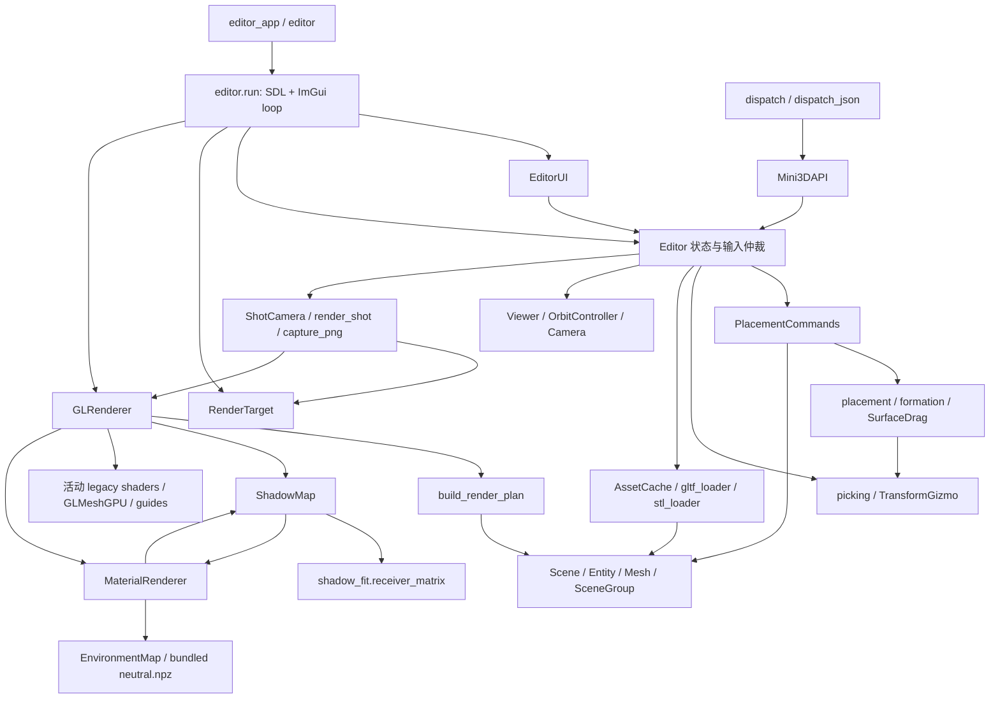
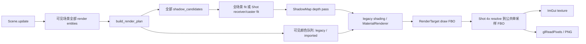

# Mini3D 当前架构与数据流

审计日期：2026-10-11。代码基线：`efd5ddc158b7a9709c420564a383b99f0e6b934b`（Renderer V2.1 Q2）。
本文描述已经存在的代码；拟调整范围见 [V2 Consolidation 审计](V2-CONSOLIDATION-AUDIT.md)。
本轮只新增文档，没有调整运行时、接口、场景格式或画质。

## 3+1 的实际组成

基线未在代码中声明名为“3+1”的包、插件或独立进程。按实际调用路径，本文将其映射为
**Renderer、Editor（含 Placement）、Photography，加一层 AI/Python/JSON API**。
这是一种职责视图：四者共享 Scene、AssetCache、Commands 和 GLRenderer，并不是四套引擎。
Placement V1/V2 是 Editor 与 API 共用的场景操作子系统。

| 系统 | 核心入口 | 实际职责 |
| --- | --- | --- |
| Renderer | `GLRenderer.render(scene, camera)` | 每帧 RenderPlan、保守剔除、阴影、legacy 与导入材质绘制、统计 |
| Editor | `editor_app.main()` → `mini3d.editor.run()` | SDL/ImGui 运行循环、输入仲裁、模型导入、选择/Gizmo/Placement、项目保存载入 |
| Photography | `render_shot()` / `capture_png()` | 独立 ShotCamera、完整摄影分辨率、干净 Scene 光照、1×/4× MSAA、PNG |
| + API | `Mini3DAPI` / `dispatch()` / `dispatch_json()` | 复用 Editor 状态和 Commands；白名单 JSON 命令、参数检查、事务限制 |

基线可用的程序入口是根目录 `editor_app.py` 和转发入口 `editor.py`。
`1.py`、`1 copy.py`、`2.py` 是仍可运行的历史示例，直接使用 Viewer/GLRenderer/URDF 等。
**基线没有 `mini3d/__main__.py`、`examples/` 或 `python -m mini3d` 统一入口**；
其他本地工作区存在的未提交整理不能当作 Q2 已有功能。
API 构造 Editor 状态对象，不调用 `run()`，不会为构造 API 自动打开 SDL/ImGui 窗口。
API 实际摄影需要调用者提供当前线程可用的 OpenGL 上下文与 caller-owned renderer。

## 模块依赖与控制路径

图中 `PLAN → S` 表示读取 Scene 协议，**不是 Python import**。
多数几何算法通过传入的 scene/entity/commands 对象工作。
AST import 核查覆盖全部 31 个 `mini3d/*.py`，包含函数内延迟 import；
动态调用和对象协议还需结合下面的执行路径理解。

主要直接依赖如下：

| 调用模块 | 依赖模块或对象协议 |
| --- | --- |
| `api` | `editor`、`camera`、`orbit_controller`、`placement`、`shot_camera`、`viewer`、`lighting`、`environment` |
| `editor` | `scene`、`viewer`、`gltf_loader.AssetCache`、`picking`、`commands`、`placement`、`placement_plane`、`editor_tools`、`model_dialog`、`shot_camera`；`run` 内加载 UI/GL/target |
| `commands` | `scene`；延迟加载 `placement`、`formation`、`surface_drag`，后两者使用传入的 commands |
| `placement` | `picking`、`scene`；`surface_drag` → `placement`，`formation` 无引擎 import |
| `scene` | NumPy；构造时延迟加载 `PlacementPlane`，不 import renderer/UI |
| `gltf_loader` | `scene`；AssetCache 延迟加载 `stl_loader` 与 `placement.create_ground` |
| `stl_loader` | `scene` 与 `gltf_loader.Asset`；这里有靠延迟 import 避开的反向依赖 |
| `viewer` | `camera`、`orbit_controller`；`orbit_controller` → `camera` |
| `gl_renderer` | `shadow_map`、`render_plan`；延迟加载 `material_renderer`、`lighting`、`shot_camera` |
| `material_renderer` | `lighting`、`shadow_map`、`environment` |
| `shadow_map` | `lighting`；延迟加载 `shadow_fit`、`material_renderer`，并调用 renderer 私有上传方法 |
| `shot_camera` | `camera`；延迟加载 `render_target`；使用传入 renderer 的协议，不 import GLRenderer |
| `render_plan` / `shadow_fit` | NumPy 与标准库；几何规划，不拥有 GPU 对象 |
| `render_target` | OpenGL 与整数校验；不拥有 Scene 或 camera |

关键环路是 `MaterialRenderer ↔ ShadowMap`：材质模块导入阴影 GLSL/bind，
阴影 pass 又借用材质模块的 `_save_state/_restore_state/_mesh/_texture`。
`GLRenderer` 另外通过 `isinstance(camera, ShotCamera)` 决定采用 Shot Fit，存在摄影类型耦合。
这些是实际存在的边界，不应通过把文件全部合并来掩盖。

## 场景与资产数据流

1. Editor/Commands 调用 `AssetCache.load(path)`。以规范化绝对路径缓存 Asset；支持
   GLB/glTF、STL、`builtin:ground`。URDF 属于历史示例路径，不是此导入菜单的通用支持项。
2. glTF loader 解码 buffer/accessor/image/material，建立 Entity 模板树和 Mesh，执行轴转换，
   支持静态默认姿态蒙皮；保留 animation 名称等元数据，不提供运行时动画系统。
   STL loader 转为同一 Asset/Entity/Mesh 协议。
3. `Asset.instantiate()` 克隆 Entity 树，**共享 Mesh/material/纹理资源**。
   根实例由 Scene 分配稳定 `ent_*` ID，导入子节点不分配编辑根 ID。
4. Commands 执行 spawn、变换、摆放、锁定、组、编队，维护快照历史和事务。
   Gizmo/SurfaceDrag 连续更新合并为一次历史操作；UI 和 API 共用这一历史栈。
   摄影/光照/保存等操作不等同于 Placement 可撤销事务。
5. `Scene.update()` 递归计算世界变换。现代实例局部矩阵为
   `T @ Rxyz @ S @ extra_local`，世界矩阵为 `parent_world @ local`。
6. `get_flat_render_list()` 遍历可见节点，隐藏父节点会排除其整个子树，只返回有 model 的节点。
   编辑组只保存根 ID 成员关系，不重排导入层级。

世界是 Z-up；Camera 使用标准 OpenGL 局部 -Z 朝前、+Y 向上。
屏幕拾取使用左上角为原点的 viewport rect，逆变换到 mesh 空间的 ray 不重新归一化，
以保留非等比缩放下的世界距离。picking 的弱引用几何缓存以 Mesh 为键；共享几何被视作不变数据。

Grid、PlacementPlane、真实 Ground 是三个不同对象：

- Grid 是辅助线，只读取深度、不写深度，不参与场景拾取/阴影/照片。
- PlacementPlane 是有限的查询平面，可作为摆放回退，无 render mesh。
- `builtin:ground` 是明确加入场景的真实 mesh，可保存、拾取、受光和投影。
- `Scene.ground` 是保留的旧槽位，现代遍历不自动渲染或查询它。

## 帧渲染与摄影数据流

实际执行顺序为规划 → 阴影深度 → 颜色 → Editor 辅助元素。
RenderPlan 每帧读取最新矩阵与 bounds，AABB 六平面保守拒绝，无跨帧变换缓存。
异常 bounds、未知 bounds、坐标轴以及 legacy OUTLINE 膨胀情况保守保留。
**颜色剔除不能过滤阴影候选**；可见性仍先服从 Scene.visible。

当前 GLRenderer 真正消费的是 `plan.legacy`、`plan.imported` 与 `shadow_candidates`。
`opaque`、`transparent` 已在 plan 分类，但 MaterialRenderer 仍重新分类并按 camera-space
中心深度排序 BLEND；计划矩阵也仍在材质路径重新读取。它们是待收敛的重复规划，
还不是统一透明排序已经实现的证明。

Legacy（没有 material）走 GLMeshGPU + REALISTIC/TOON/OUTLINE；导入 mesh 走 MaterialRenderer
的 Lit/Unlit/Wireframe、PBR、alpha OPAQUE/MASK/BLEND、doubleSided、贴图。
这两组 render mode 是不同作用域。Draw call 统计覆盖场景颜色和阴影绘制，
不等于含 grid/axes/选择描边/ImGui 的整个窗口全部提交。

阴影仅在启用、Scene lighting、Lit 条件下执行。Editor Camera 使用全场景包围盒；
ShotCamera 使用 `receiver_matrix()`，把 receiver 与 frustum 相交并保留可投到画内的画外 caster
深度范围，失败回退全场景。拟合缩小区域**不意味着 depth pass 已按 caster 列表裁剪**：
它仍遍历完整候选，BLEND 不投影、MASK 使用 alpha cutoff。
两种 mesh GPU 上传均由原 renderer 缓存承担，ShadowMap 不另建几何副本。

MaterialRenderer 的 PBR 输出沿用线性光照/IBL相加、Reinhard 与 sRGB 编码，写 RGBA8。
环境贴图是随包分发的固定 `neutral.npz`，运行时不烘焙；默认禁用。
材质纹理占用 unit 0–6，shadow 为 7，IBL 为 8–10。

`render_shot()` 浅拷贝 Scene 状态，关闭 grid/axes，强制 Lit + Scene lighting，
使用 ShotCamera 原画幅渲染。它不更改原 Scene 光照模式，但仍共享实体资源。
ShotCamera 独立于 Viewer 相机，保存 lens/aspect/near/far/samples；默认 samples=1。
`capture_png()` 更新 Scene，临时创建 target、调用同一摄影 pass、读回 PNG，最后释放 target，
恢复 renderer 尺寸、caller 的独立 READ/DRAW FBO 与 viewport。

RenderTarget 的公共 `texture/framebuffer/depth` 是 RGBA8 + D24S8 单采样目标。
4× 增加两只 multisample RBO 和一只 FBO；同尺寸 NEAREST blit 解析 color/depth/stencil，
再供 ImGui 和读回使用。resize 保持公共纹理 handle；切回 1× 释放额外缓冲。
MSAA 只增加覆盖样本，当前在已经编码的 RGBA8 上解析，不改变阴影采样或变成线性 HDR 后处理。

## 生命周期与持久化边界

| 对象 | 所有者与释放 |
| --- | --- |
| Scene/Entity、AssetCache 模板 | Editor/Commands 持有 CPU 状态；clone 共享 mesh；不是 GPU 资源所有者 |
| GLMeshGPU、legacy programs、grid/axes buffers | GLRenderer；`close()` 在 GL context 退出前释放 |
| material meshes/textures/programs | MaterialRenderer；`release()` 清资源缓存，`close()` 释放完整 renderer |
| IBL 三张纹理 | MaterialRenderer 的 EnvironmentMap，按需创建并随关闭释放 |
| shadow depth texture/FBO/program | ShadowMap，分辨率变化重建，close 释放 |
| Editor preview target | `editor.run()`；PNG 临时 target 由 `capture_png()` 的 finally 释放 |
| SDL context、ImGui backend、预览图纹理、模型对话框 | `editor.run()`；窗口循环结束时清理 |

保存/载入仍由 Editor 方法实现，写 Scene JSON v3，载入兼容 v1/v2/v3。
保存根对象资产路径与 TRS/metadata、组/选择/ID计数器、Viewer snapshot、ShotCamera、
lighting/shadows/environment、render mode、grid 和 PlacementPlane；不是 GPU handles 的快照。
载入先建临时 Scene/Viewer、检查参数，再替换实时状态并清历史；不能拆分后改变其原子性。
缺少/null ShotCamera 清除上一场景相机，缺少 samples 默认 1。

## 质量证据与适用范围

长期回归由 CPU 单测和真实 GPU smoke 两部分组成；GPU 驱动状态、alpha、离屏 caster、
FBO/Stencil/MSAA 解析不能只用 mock 或静态检查验收。
基线证据见 [V2 Core](renderer-v2/milestone-1.md)、[CPU Cache](renderer-v2/milestone-2a.md)、
[Q1](renderer-v2/quality-q1.md)、[Q2](renderer-v2/quality-q2.md)。
Q2 的 `.blend`、相同模型/HDR/参数、原始 Eevee/Mini PNG、原始性能样本、manifest 和 NOTICE
共同构成摄影基准；并排缩略图不替代原始证据。
Blender 是外部离线基准工具，不是 Mini3D 运行时依赖。

已知边界包括参考球极点/退化几何、阴影接触/自阴影、两边颜色与积分约定、
透明 mesh 中心排序、静态 skinning、同步摄影以及大型场景 CPU 开销。
本轮 Consolidation 不新增画质、C++、Filament、LOD、Instancing，也不调整这些既有边界。
