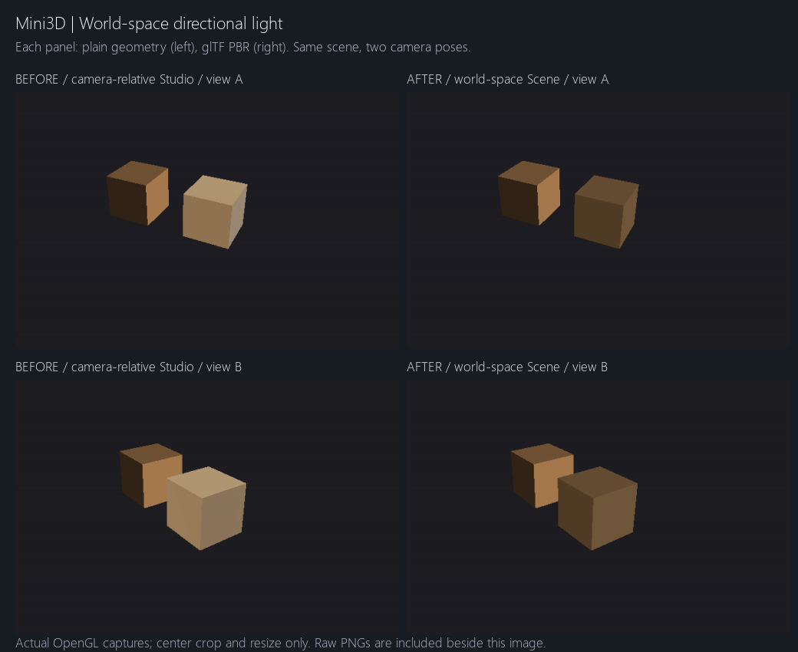

# Mini3D 第一轮开源功能移植实验：世界空间 Directional Light

验证日期：2026-10-08。修改前基线：`faa0a52`。

## 项目理解与本轮范围

Mini3D 是 Python / NumPy / Pygame / OpenGL 的轻量三维编辑、摆放和拍照工具。
`Scene` 管理 Entity 层级和共享模型资源；`Camera` 保存姿态及投影，`Viewer` 与
`OrbitController` 负责编辑器导航。`PlacementCommands` 管理摆放、锁定、编组、编队和撤销。
`Mini3DAPI` / JSON dispatcher 复用这些命令，供 AI 或 Python 程序操作场景。
`ShotCamera` 独立保存拍摄姿态，Camera View 与 PNG 共用 `render_shot()`。

渲染入口 `GLRenderer` 将普通几何送入原有 Lambert / Toon shader，将带材质的
glTF、STL、Ground Mesh 送入 `MaterialRenderer`。后者已有 metallic/roughness GGX、
贴图、法线、AO、自发光及 specular 支持。本轮只接入方向光，不复制整个渲染器，
不改变 Scene、Camera、Entity、AI API 的现有调用接口。

## 参考源码、许可证与移植判断

参考项目：[KhronosGroup/glTF-Sample-Viewer](https://github.com/KhronosGroup/glTF-Sample-Viewer/tree/b6f9275f7a95a8a12804e0ff33af3df3c7e9ccc5)，
其渲染实现位于子模块 **glTF-Sample-Renderer**。研究按 Viewer 固定的子模块提交
`cc27919cacbb235d2f58a0c0203387efce9375f8` 核对，避免只依赖浮动主分支。

| 来源 | 研究结果及 Mini3D 适配 |
| --- | --- |
| [gltf/light.js](https://github.com/KhronosGroup/glTF-Sample-Renderer/blob/cc27919cacbb235d2f58a0c0203387efce9375f8/source/gltf/light.js) | `toUniform()` 从节点世界变换取得朝向，以本地 -Z 为发光方向。Mini3D 暂无灯节点，直接使用已有世界向量。 |
| [Renderer/renderer.js](https://github.com/KhronosGroup/glTF-Sample-Renderer/blob/cc27919cacbb235d2f58a0c0203387efce9375f8/source/Renderer/renderer.js) | `applyLights()` 上传灯参数；相机位置另行上传。Mini3D 保留相机用于观察向量和高光，Scene 光方向不访问相机。 |
| [shaders/pbr.frag](https://github.com/KhronosGroup/glTF-Sample-Renderer/blob/cc27919cacbb235d2f58a0c0203387efce9375f8/source/Renderer/shaders/pbr.frag) | 方向光的表面到光源向量是发光方向的反向，随后在世界空间计算 N·L。沿用 Mini3D 原有 BRDF，只更换光照输入。 |
| [shaders/punctual.glsl](https://github.com/KhronosGroup/glTF-Sample-Renderer/blob/cc27919cacbb235d2f58a0c0203387efce9375f8/source/Renderer/shaders/punctual.glsl) | Directional 分支不使用距离、范围或锥角衰减。本轮仅实现这一种光。 |
| [KHR_lights_punctual 规范](https://github.com/KhronosGroup/glTF/blob/main/extensions/2.0/Khronos/KHR_lights_punctual/README.md#directional) | 方向来自节点朝向，光源视为无限远。本轮实验采用该方向语义，不声称完整实现该扩展。 |

Viewer 与 Renderer 的仓库许可证均为 **Apache-2.0**，参见
[Viewer LICENSE.md](https://github.com/KhronosGroup/glTF-Sample-Viewer/blob/b6f9275f7a95a8a12804e0ff33af3df3c7e9ccc5/LICENSE.md) 和
[Renderer LICENSE.md](https://github.com/KhronosGroup/glTF-Sample-Renderer/blob/cc27919cacbb235d2f58a0c0203387efce9375f8/LICENSE.md)。
规范页另有 Khronos 版权条款，署名 Copyright 2017–2018 The Khronos Group Inc.，不能当作 Apache 代码许可证。

**本次未直接复制或逐行翻译参考项目源码。** 新增代码是针对 Mini3D 现有数据流的独立实现，
原有 GGX、色彩转换和 Studio 算法保留在原项目中。本轮没有引入第三方源码文件；
因此没有需要随复制源码附带的上游许可证或版权头。上述链接记录研究来源，不替整个
Mini3D 项目新增或变更许可证。`lighting_fixture.py` 生成的测试几何、glTF 材质和测试截图均为本项目原创，
不依赖外部模型下载。回归使用的既有模型仍遵循 [model/README.md](../model/README.md) 的各自许可，未重新打包。

## 实现与使用

```python
scene.lighting_mode = 'Scene'  # 或 'Studio'，编辑器默认保持 Studio
scene.light_dir = [0.8, -0.15, 0.5]  # 世界空间，从表面指向光源
scene.diffuse = 0.9
scene.ambient = 0.12
```

Mini3D 世界坐标为 Z-up，`light_dir` 与 glTF 的发光方向符号相反；这里不对它再次执行
glTF Y-up → Z-up 转换，也不乘相机矩阵。`scene_light_direction()` 统一校验并归一化，
不修改原向量。普通几何的 Realistic / Toon 与 glTF Scene Lighting 上传同一方向。

Editor 视口新增 **Studio Lighting / Scene Lighting** 下拉框。Studio 保留原先的三盏
随相机旋转的 glTF 灯和解析反射面板；普通几何在 Studio 中保持原有世界方向光行为。
Scene 模式的 glTF 仅使用一盏白色方向光，复用 `scene.diffuse` 和 `scene.ambient`，
不叠加 Studio 补光或反射面板。环境项是简单的无方向漫反射填充，设为 0 即可关闭。

`render_shot()` 在场景浅拷贝上强制 Scene Lighting，覆盖 Camera View、Capture 和
AI API capture，编辑器的模式不被改写。Camera View 明确显示 **Scene Lighting (Shot)**。
场景 JSON v3 新增可选 `lighting` 数据，保存模式、方向和 ambient/diffuse；旧 v1/v2/v3
没有这些字段时按原默认值载入，非法数据在替换场景前拒绝。

亮度不要求普通几何与 glTF 完全相同：前者保留原来的 Lambert 显示，后者包含 GGX、
漫反射的 1/π、sRGB 与原有色调压缩。`diffuse` 保持 Mini3D 的相对强度含义，尚未标定为 lux。
高光/Fresnel 可以随观察位置变化；**固定的是世界光方向及 N·L，而非所有屏幕像素。**

没有添加阴影、点光源、聚光灯、HDR、IBL 或灯光 Entity；也没有添加 glTF 灯节点导入。
`extensionsRequired` 中要求 `KHR_lights_punctual` 的模型仍由原 loader 报不支持，
本轮只移植世界方向光机制，没有宣称扩展兼容性。

## 前后截图



每格左侧是普通几何，右侧是正常 glTF PBR 材质（metallic=0、roughness=1，无 unlit 扩展）。
上、下两行分别是相机 A `(4,-8,5)`、B `(7,-5,4)`，均看向原点。
光方向始终为 `(0.8,-0.15,0.5)`，ambient=0.12、diffuse=0.9。左列在修改生产代码前实际采集，
右列为修改后的 Scene Lighting。拼图只做中心裁切和等比缩放，未调亮、重绘或生成渲染内容。

| 视角 | 修改前原图 | 修改后 Scene 原图 | 保留的 Studio 原图 |
| --- | --- | --- | --- |
| A | [before-a.png](lighting/before-a.png) | [scene-a.png](lighting/scene-a.png) | [studio-a.png](lighting/studio-a.png) |
| B | [before-b.png](lighting/before-b.png) | [scene-b.png](lighting/scene-b.png) | [studio-b.png](lighting/studio-b.png) |

两视角的保留 Studio 图与修改前图逐像素一致。

## 测试与结果

环境：Windows、Python 3.8.20、Pygame 2.6.1、Intel UHD Graphics 620，真实桌面 OpenGL。

| 测试 | 结果 |
| --- | --- |
| 修改前 `unittest discover -s tests -v` | 197 项通过 |
| 修改后完整单元测试 | 205 项通过，含新增 8 项光照合同/持久化测试 |
| `lighting_smoke.py docs/lighting` | PBR/普通几何受光面、相机环绕/平移/原地旋转、切换光方向、零强度、Studio 基线与 Shot 覆盖均通过 |
| `ground_separation_smoke.py` | 通过；四视角渲染、网格不写深度、照片网格开关、Ground 与表面放置 |
| `placement_smoke.py` | 通过；真实 Editor 摆放、锁定、撤销、保存加载 |
| `placement_v2_smoke.py` | 通过；多选、编组、40 人编队及撤销重做 |
| `photo_smoke.py` | 通过；实际按钮、镜头/比例、1920 宽 PNG 与预览 FBO 一致 |
| `ai_api_smoke.py` | 通过；仅经 API 建立 40 人编队、变换、保存重载、50mm 16:9 PNG 与 JSON 状态 |

新增 GPU 测试不是比较相机移动前后的同一屏幕坐标，而是将固定世界面中心投影到各自画面后采样。
令 `light_dir=(5,0,0)`、ambient=0：四种相机状态中普通几何 +X 面均为 RGB `(190,140,90)`；
PBR +X 面分别为 `(107,84,56)`、`(107,83,55)`、`(107,83,55)`、`(107,83,55)`。
两条路径的 -Y、+Z 面始终为 `(0,0,0)`。将光改为 `(0,-1,0)` 后，+X 变暗、-Y 变亮。
关掉 direct/ambient 后没有 Studio 光泄漏；Shot 输出不受 Editor 模式影响。

详细 GPU 数据：[results.json](lighting/results.json)。回归原始日志摘录与完整单测日志：
[regression-results.txt](lighting/regression-results.txt)、[unit-tests.txt](lighting/unit-tests.txt)。
大型回归截图与场景保留在本地 `captures/lighting-regression/`，不纳入本次 Git 提交。

复现（项目目录执行）：

```powershell
& F:/gymenv/python.exe -B -m unittest discover -s tests -v
& F:/gymenv/python.exe -B tests/lighting_smoke.py docs/lighting
& F:/gymenv/python.exe -B tests/ground_separation_smoke.py captures/lighting-regression/ground
& F:/gymenv/python.exe -B tests/placement_smoke.py captures/lighting-regression/placement
& F:/gymenv/python.exe -B tests/placement_v2_smoke.py captures/lighting-regression/placement-v2
& F:/gymenv/python.exe -B tests/photo_smoke.py captures/lighting-regression/photography
& F:/gymenv/python.exe -B tests/ai_api_smoke.py captures/lighting-regression/ai-api
```

后五项中的真实资产回归沿用本地已存在模型；光照 fixture 与单元测试不依赖它们。
如需重采集旧版图，在 `faa0a52` 的隔离检出中放入这次的 `tests/lighting_fixture.py` 和
`tests/lighting_smoke.py`，以 `--baseline` 运行；不要在新版代码上覆盖旧图。

## 修改文件

- `mini3d/lighting.py`：世界方向统一校验、归一化及符号约定。
- `mini3d/scene.py`：模式默认值、方向说明。
- `mini3d/gl_renderer.py`：普通几何两条渲染路径复用归一化入口。
- `mini3d/material_renderer.py`：Scene / Studio 分支，沿用原 PBR。
- `mini3d/shot_camera.py`：拍照与预览强制 Scene Lighting。
- `mini3d/editor_ui.py`：Editor 模式选择与 Shot 提示。
- `mini3d/editor.py`：可选光照字段保存、加载与原子校验。
- `tests/test_lighting.py`、`tests/lighting_fixture.py`、`tests/lighting_smoke.py`：单测、自建 PBR 模型及真实 GPU 验证。
- `readme.md`、本报告及 `docs/lighting/`：使用说明、来源、结果与对照截图。
