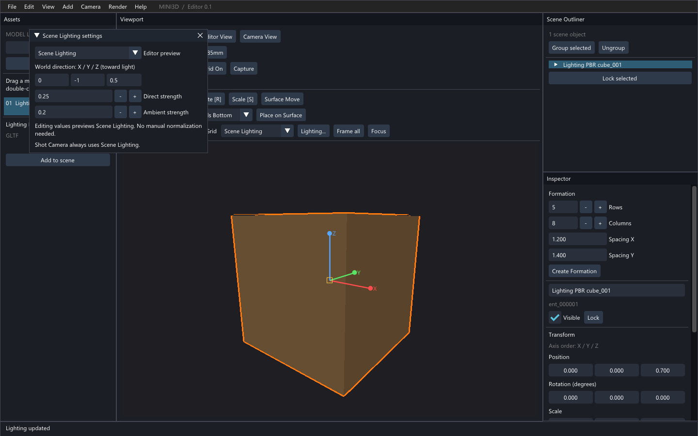
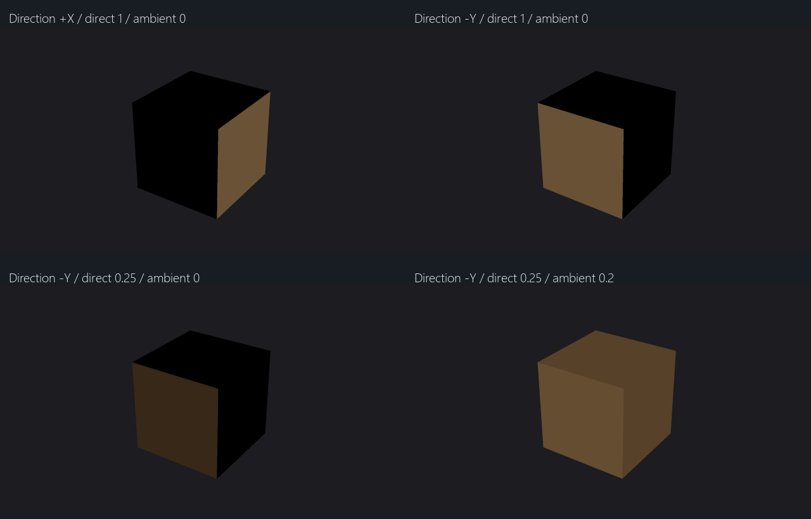

# Lighting V1 操作接口与验收

开发基线：`feature/world-directional-light` / `48e8912`。
交付分支：`feature/lighting-v1-controls`。验收：2026-10-08 至 2026-10-09。

## 操作方式

点击视口工具栏 **Lighting...**，或菜单 **Render → Lighting settings**，打开场景光照窗口。
可输入世界方向 X/Y/Z、Direct strength（diffuse）、Ambient strength（ambient）。
方向从表面指向光源，不必手动归一化。零向量、非有限值和负强度被拒绝，窗口显示错误，原光照保持不变。
合法数值修改立即切换至 Scene Lighting 预览；仍可在窗口或工具栏切回 Studio Lighting。
窗口无需选择 Entity，可以移动、折叠或关闭；输入时不会触发视口操作。



## Python / JSON API

```python
api.get_lighting()
# {'mode': 'Studio', 'direction': [...], 'diffuse': 0.7, 'ambient': 0.3}

api.set_lighting(mode='Scene', direction=[3, -4, 2], diffuse=1.2, ambient=0.15)
api.set_lighting(diffuse=0.4)  # 其他参数保持不变
api.get_scene_state()['lighting']
```

`get_lighting()` 返回独立的普通 dict/list，字段为 `mode`、`direction`、`diffuse`、`ambient`。
`set_lighting(mode=None, direction=None, diffuse=None, ambient=None)` 返回修改后的同类快照。
省略参数或传 `None` 均表示保留旧值；全部省略不会改变参数。

- `mode` 必须为 `'Studio'` 或 `'Scene'`，区分大小写。
- `direction` 必须包含三个有限实数，且不全为零。保存和查询保留原始分量，Renderer 继续自动归一化。
- `diffuse`、`ambient` 必须是有限、非负实数。字符串、布尔值、NaN/Infinity、错误向量尺寸会报错。
- 一次调用先验证全部候选参数，再一起写入；有任意错误就不修改任何光照参数。
- API 不会自动切换未指定的模式；编辑器数值控件的自动 Scene 预览是 UI 行为。

JSON 白名单已增加两个方法：

```json
{"command":"set_lighting","args":{"mode":"Scene","direction":[0,-7,0],"diffuse":1,"ambient":0}}
```

```json
{"command":"get_lighting"}
```

响应遵循原有 `{"ok":true,"result":...}` / `{"ok":false,"error":...}` 格式。
`get_scene_state()` 在原字段之外增加 `lighting`。

光照设置不属于 Placement 撤销历史：`set_lighting()` 在活动 Placement transaction 内报错，
也不允许放入 JSON transaction batch；批处理会在执行任何操作前拒绝它。
`get_lighting()` 可以在事务中查询。外部调整光照不会清空 Placement undo/redo。

Scene JSON 仍为 v3，存储键仍是 `lighting.mode/light_dir/diffuse/ambient`，不改变上一轮格式。
API 的 `direction` 对应存档的 `light_dir`。缺少光照字段的旧 v1/v2/v3 场景使用默认值。
存档中的非法光照在替换实时场景之前被拒绝。

## 从建模到摄影的完整示例

```python
import pygame
from mini3d.api import Mini3DAPI
from mini3d.gl_renderer import GLRenderer

pygame.init()
pygame.display.set_mode((640, 480), pygame.OPENGL | pygame.DOUBLEBUF)
renderer = GLRenderer(640, 480)
api = Mini3DAPI(renderer=renderer)
try:
    api.spawn('docs/lighting/pbr-cube.gltf')
    api.set_lighting(mode='Studio', direction=[5, 0, 0], diffuse=1, ambient=0)
    api.create_shot_camera(position=[4, -6, 4], target=[0, 0, 0], focal_mm=50)
    api.capture('captures/light-x.png')
    api.set_lighting(direction=[0, -7, 0])
    api.capture('captures/light-y.png')
    api.save_scene('captures/lit-scene.json')
finally:
    if hasattr(renderer, 'material_renderer'):
        renderer.material_renderer.close()
    pygame.quit()
```

Shot Camera 的 Camera View、PNG 与 AI capture 始终强制 Scene Lighting。
例子故意保持 Editor 模式为 Studio，两张照片仍由上述世界方向和强度控制。
相机仍只影响观察方向与 PBR 高光，不能带动世界光方向。

## 自动与真实 GPU 验收

环境：Windows、Python 3.8.20、Pygame 2.6.1、Intel UHD Graphics 620。

| 验收 | 结果 |
| --- | --- |
| 完整单元测试 | 216 项通过，新增 11 项 Lighting API 测试 |
| 原 Lighting GPU 回归 | 通过，普通几何/PBR 世界方向、Shot 覆盖、Studio 隔离 |
| Ground | 通过，图像/深度、网格和显式 Ground |
| Placement V1 / V2 | 均通过，真实 Editor 操作、撤销、编组和 40 人编队 |
| Photography | 通过，真实按钮、镜头/画幅、6 张 PNG 与预览一致 |
| AI API | 通过，40 人编队 → 保存重载 → 50mm 16:9 PNG |
| 新 Lighting API GPU 流程 | 通过，公共 API 建模、JSON 光照、Camera 移动旋转、10 张 PNG、保存重载及非法输入 |
| 新 Lighting UI GPU 流程 | 通过，真实 SDL 鼠标键盘驱动 X/Y/Z、直射和环境强度输入；零向量不改参数或视口像素 |

记录：[完整单测](lighting-v1/unit.txt)、[回归退出码及命令](lighting-v1/regressions.json)、
[API GPU 逐图参数与采样](lighting-v1/results.json)。各回归原始日志位于同目录对应 `.txt` 文件。

使用原有原创 glTF PBR cube，metallic=0、roughness=1，无 `KHR_materials_unlit`。
测试在每张图中重新投影固定世界面中心并采样，不把相同屏幕像素误当成相同模型点。

| 配置 | +X 面 RGB | -Y 面 RGB |
| --- | --- | --- |
| 光方向 +X，直射 1，环境 0 | 107,84,56 | 0,0,0 |
| 光方向 -Y，直射 1，环境 0 | 0,0,0 | 107,83,56 |
| 光方向 -Y，直射 0.25，环境 0 | 0,0,0 | 57,42,25 |
| 光方向 -Y，直射 0.25，环境 0.2 | 89,67,42 | 102,79,51 |

环绕、平移、原地旋转 Camera 后，+X 光始终照亮 +X 面，另两面仍为黑色。
Studio/Scene 预览模式对应的 Shot PNG 逐像素相同；保存重载前后逐像素相同；非法输入前后逐像素相同。



原始 1920×1080 PNG：[+X 光](lighting-v1/01-x-light.png)、[-Y 光](lighting-v1/06-y-light.png)、
[降低直射](lighting-v1/07-y-dim.png)、[增加环境光](lighting-v1/08-ambient-fill.png)。拼图仅缩放原始截图。

```powershell
& F:/gymenv/python.exe -B -m unittest discover -s tests -v
& F:/gymenv/python.exe -B tests/lighting_api_smoke.py captures/lighting-v1
& F:/gymenv/python.exe -B tests/lighting_ui_smoke.py captures/lighting-v1-ui
```

原有各回归的完整命令见 `regressions.json`。真实模型回归依赖本地既有资产；新增光照测试使用仓库自带 fixture。

## 修改文件与范围

生产代码仅修改五个文件：

- `mini3d/lighting.py`：共享校验、原子更新与可序列化快照。
- `mini3d/editor.py`：UI/API 共用写入入口、事务保护，复用验证加载 v3 光照。
- `mini3d/editor_ui.py`：光照窗口、入口、数值编辑及错误提示。
- `mini3d/api.py`：get/set 方法及 scene state 扩展。
- `mini3d/api_dispatch.py`：白名单与 Placement batch 限制。

新增测试：`test_lighting_api.py`、`lighting_api_smoke.py`、`lighting_ui_smoke.py`。
文档：本报告、`development-progress.md`、README/API 文档链接及 `docs/lighting-v1/` 验收产物。
沿用上一轮的原创 PBR fixture；没有增加第三方代码、模型或依赖。

未修改 Renderer、Camera、Entity、Placement 实现，也未修复另行诊断的相机远裁剪问题。
没有新增阴影、点/聚光灯、灯光 Entity、HDR/IBL、多光源或 C++。
本轮完成后停止，分支只推送，不合并 main。
