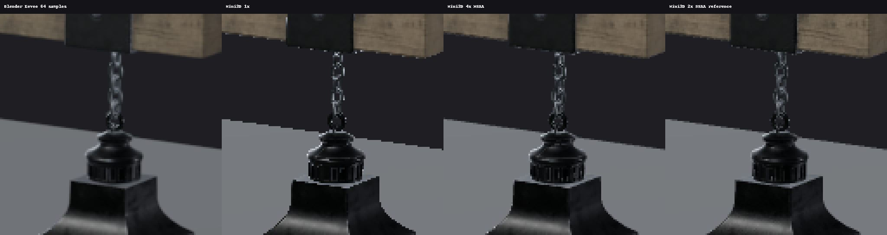
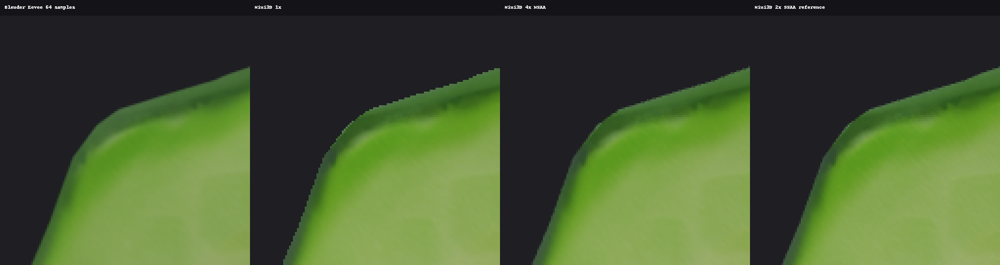

# Renderer V2.1 Q2：Blender Eevee 对照与 Shot 4× MSAA

本轮补上了可复现的 Blender 参考，并实现可关闭的正式 Shot 4× MSAA。
在这三个固定机位，轮廓与细链条得到改善；最大的剩余差距仍是阴影接触、自阴影和照明模型，
不是轮廓抗锯齿。相对 2× SSAA 的诊断覆盖误差降低 **73%–74%**，
不能把这个局部几何指标解释成“整体 Blender 画质差距减少 74%”。

基线：`feature/renderer-v21-quality-q1`，`1481814e209c92df6c88eef79229dcb98e43615f`。
独立分支 `feature/renderer-v21-quality-q2`，独立 Worktree；主工作区未提交修改保留。
执行顺序是先完成三组 Eevee 原图及几何/相机对齐，再做 MSAA；没有增加后续画质系统。

## A：对齐后的参考

本机原来没有可用 Blender，使用校验过的官方便携 **Blender 3.6.23 / e467db79ca8c**，
独立 Eevee 渲染；不编译、不嵌入 Blender，不使用 Cycles。Windows x64 包：
[固定下载地址](https://download.blender.org/release/Blender3.6/blender-3.6.23-windows-x64.zip)，
[官方校验表](https://download.blender.org/release/Blender3.6/blender-3.6.23.sha256)。
ZIP SHA-256：`e3296eba7eab32c2e5182459ec7614af32224eee2bd32c9d0a08ffd751c54f3b`。
下载包和解压目录只留在忽略的 `captures/blender`。

使用本机已有 **Lantern、Avocado 原 GLB**，其内容另与固定上游文件重新核对 SHA-256 相同。
八个金属/非金属球和地面使用 Q1 同一 `make_sphere(.55,40,64)` / `make_box(1,1,1)`、
同一导出法线和材质参数；两边导入完全相同 glTF。资产、HDR 许可和署名见 [NOTICE](q2/NOTICE.md)。

| 参数 | Mini3D / Blender 对齐方式 |
| --- | --- |
| 世界坐标 | 都是 Z-up；两边 GLB 导入器分别将 glTF Y-up 转到相同世界轴 |
| 模型变换 | 原始模型等比归一化到 Z 高度 2、XY 居中、贴地；球和地面变换逐项复制 |
| 几何核对 | 每个实例遍历全部世界顶点，对比世界 AABB；最大误差 `1.55e-7` |
| 摄影机 | 复制同一 position 和完整 rotation 矩阵，局部 -Z 为观察方向、+Y 为相机上方 |
| 焦距/FOV | 50 mm，36 mm 水平胶片门，16:9，1920×1080，near .03 / far 100 |
| 投影核对 | Blender `calc_matrix_camera` 与 Mini3D 投影逐项比较，最大误差 `3.95e-7` |
| Lantern/Avocado 机位 | `[3.4,-5.2,2.9]` 看向 `[0,0,1]` |
| 球体机位 | `[0,-9,4.2]` 看向 `[0,0,1.25]` |
| 方向光 | 白色，表面到光源 `normalize([-3,-4,6])`；Blender SUN 局部 +Z 对准该方向，发射沿 -Z |
| 强度 | Mini3D diffuse 2.0；Blender SUN energy 2.0、angle 0；位置无衰减，不用位置向量代替方向 |
| 环境 | 相同未改动 Studio Small 02 2k HDR，intensity / World Strength **0.35**，不旋转环境 |
| 球材质 | 上排 metallic 1，下排 0；从左到右 roughness .08/.30/.60/1.00，linear baseColor `[.55,.25,.07]` |

HDR 方向经过 [Blender 3.6.23 环境采样源码](https://github.com/blender/blender/blob/v3.6.23/source/blender/gpu/shaders/material/gpu_shader_material_tex_environment.glsl)
与 Q1 的 `(x,z,-y)` cube 变换核对；环境不是随摄影机旋转的图片背景。

颜色管理：Mini3D 沿用线性 GGX/IBL 相加、曝光乘数 **1.0**、逐通道 Reinhard、sRGB 输出。
Blender 设置 display `sRGB`、view `Standard`、look `None`、exposure **0 EV**、gamma 1、dither 0；
合成器在真实 Eevee 线性结果上执行相同 `c/(1+c)`，再交给 Standard 转 sRGB。
透明 World 仅隐藏 HDR 背景，真实几何和环境光仍照常渲染；合成同一 `[30,30,35]` 清屏颜色。
合成前后正确处理 premultiplied alpha。没有增加曝光、改白平衡或以二维照片替代模型。

不能等价转换的部分明确保留：

- Mini3D 的 `ambient=.12` 是额外的 `(1-metal)*baseColor*AO*.12`，Eevee 没有完全相同的参数；
  Eevee 仅用 HDR World 和 SUN，没有添加假灯或额外 emission 来拟合颜色。
  因此非金属明暗差异不能全部归咎于 Shader 错误。
- 两边方向光强度数值相同，但 BRDF/能量约定和积分实现不同，未进行物理辐照度标定。
  Q1 GGX 可见性、单次散射和 IBL 预过滤分辨率与 Eevee 也不同。
- Mini3D 阴影是 Shot Fit 单张 1024、bias .0003、PCF；Eevee 为四级 SUN cascade 1024、
  shadow bias 1.0、clip start .05、max distance 200，contact shadows/soft shadows/GTAO/SSR 均关闭。
  bias 的数值和空间不能直接换算。完整默认值见 [实际 Blender 阴影设置](q2/blender-shadow-settings.json)。
- Eevee 使用 **64 个 TAA 渲染样本**，会重新采样材质和阴影；Mini3D MSAA 只增加几何覆盖样本。
  Eevee 先平均线性辐射再做色调映射；本轮 Mini3D 在既有 RGBA8、已编码 sRGB 的输出上解析。
  高反差边缘的混合颜色不要求相同；未改写现有颜色管线为 HDR/线性后期系统。

### 场景、原图和比较

| 场景 | Blender 文件 / 参数 | 原始 PNG | 并排 / 差异 / 局部放大 |
| --- | --- | --- | --- |
| Lantern | [场景](q2/Lantern.blend) / [Mini 参数](q2/Lantern-mini-scene.json) | [Eevee](q2/Lantern-eevee.png)、[1×](q2/Lantern-mini-1x.png)、[4×](q2/Lantern-mini-4x.png)、[SSAA](q2/Lantern-mini-ssaa2.png) | [并排](q2/Lantern-comparison.png)、[差异](q2/Lantern-differences.png)、[链条](q2/Lantern-chain-zoom.png)、[阴影](q2/Lantern-shadow-zoom.png) |
| Avocado | [场景](q2/Avocado.blend) / [Mini 参数](q2/Avocado-mini-scene.json) | [Eevee](q2/Avocado-eevee.png)、[1×](q2/Avocado-mini-1x.png)、[4×](q2/Avocado-mini-4x.png)、[SSAA](q2/Avocado-mini-ssaa2.png) | [并排](q2/Avocado-comparison.png)、[差异](q2/Avocado-differences.png)、[轮廓](q2/Avocado-outline-zoom.png)、[阴影](q2/Avocado-shadow-zoom.png) |
| 材质球 | [场景](q2/spheres.blend) / [Mini 参数](q2/spheres-mini-scene.json) | [Eevee](q2/spheres-eevee.png)、[1×](q2/spheres-mini-1x.png)、[4×](q2/spheres-mini-4x.png)、[SSAA](q2/spheres-mini-ssaa2.png) | [并排](q2/spheres-comparison.png)、[差异](q2/spheres-differences.png)、[反射](q2/spheres-reflection-zoom.png)、[轮廓](q2/spheres-outline-zoom.png) |

并排图只缩小预览；局部图为同一坐标 128×128 裁剪，用最近邻放大 4×，不磨皮、不锐化。
差异图为 `4 * abs(RGB差)`，截到 255；它包含两个渲染器照明/阴影约定差异，不是逐像素正确性评分。
原始 PNG 均为直接渲染/摄影保存的 1920×1080 文件。





阶段 A 的发现：相机、几何轮廓和原纹理位置相符，没有发现真实 GLB 的基础转换错误。
金属软箱反射位置/粗糙度变化总体相符，果肉/果皮/果核保留各自颜色。
最大可见剩余问题是地面投影的形状与接触、自阴影离散边缘，尤其球体上的自阴影盖状边界；
Eevee 也存在这些问题，因此这里的 Eevee 是固定配置参考，而非无误差真值。

球体文件检查发现 **2/2560 个零长度法线**、重复极点/退化三角形。
Eevee 前侧极点出现暗尖/环。先报告并隔离后才实施 AA：
[关闭阴影的诊断图](q2/spheres-diagnostic-no-shadow.png)仍有暗尖，
[径向法线诊断图](q2/spheres-diagnostic-radial-normals.png)减轻暗尖，但环和自阴影差异仍未完全消失。
这些诊断只定位到参考球几何/法线处理相关问题，不能声称已彻底查明环的原因。
主对照保持 Q1 原始几何/法线，不用 MSAA 隐藏或偷偷修复它。

## B：正式 Shot MSAA

`RenderTarget` 的公共 `texture/framebuffer/depth` 仍是单采样 RGBA8 + D24S8，供 ImGui 和读回使用。
4× 模式另建多采样 RGBA8 颜色 RBO、D24S8 深度/Stencil RBO 和 FBO。
绘制后用同尺寸 `glBlitFramebuffer`、`GL_NEAREST` 解析颜色、深度和 Stencil，
再绑定公共单采样 FBO。这遵循 [Khronos blit 规则](https://github.com/KhronosGroup/OpenGL-Refpages/blob/main/gl4/glBlitFramebuffer.xml)，
不是仅打开 `GL_MULTISAMPLE`。

每次分配检查 FBO 完整性和实际 4 样本数量；能力不足明确报错，不静默把 4× 当成 1×。
Resize 保持公共 texture handle，恢复调用者独立 READ/DRAW FBO、纹理/RBO 绑定；
关闭 AA 删除额外缓冲，close 可重复调用。解析避免受调用者 scissor 限制。
Shot 临时启用 `GL_MULTISAMPLE` 并恢复原开关；PNG 导出恢复独立 READ/DRAW FBO 和 viewport。
Editor View 明确回到单采样，保留已有选择描边 Stencil、拾取和 ImGui 显示路径。

```python
api.create_shot_camera(position=[3.4,-5.2,2.9], target=[0,0,1], focal_mm=50)
api.set_antialiasing(samples=4)
api.capture('photo-msaa.png')
api.save_scene('photo-scene.json')  # shot_camera.samples=4
api.set_antialiasing(samples=1)     # 回到旧路径
```

也支持 JSON 命令 `set_antialiasing`。只接受整数 1/4，拒绝布尔、浮点和其他值，
不能混入 placement transaction。旧场景缺少 samples 时默认 1；新建 Shot 也默认 1。
设置同时作用于 Camera View 与 PNG。没有添加新的 AA UI 控件。

可选参考 SSAA 在工具中使用真正 **3840×2160** 三维渲染，同机位同投影，
再对四个像素执行等权面积平均，输出 1920×1080。它不是对 1× 图片加模糊。
沿用输出颜色空间；仅作质量参考，没有加入摄影 API 或测量其性能。

## C：改善、代价与回归

硬件为 **Intel Core i7-8550U / Intel UHD Graphics 620**，Windows 10，
驱动实际 OpenGL `4.6.0 - Build 27.20.100.8682`。
Python 3.8.20、NumPy 1.24.3、pygame 2.6.1、PyOpenGL 3.1.10；比较工具另用 Pillow。
MSAA/FBO/blit 使用 OpenGL 3.3 可用 API；已有 IBL GPU 回归请求 3.3 core 并在该驱动通过。
没有宣称测试了其他 UHD 620 驱动、平台或 GPU。

GPU 用 `GL_TIME_ELAPSED`，包含 RenderPlan/阴影/颜色/resolve 提交区间；
同步 CPU+GPU 用 `glFinish + perf_counter`，包含 Python 提交，均不含 Scene.update、读回和 PNG。
预热后同进程交替 1×/4×、各 8 次，复用两套 target，避免反复分配偏置。
完整摄影为各 3 次已预热公开 `api.capture`，包含新 FBO 分配、Scene.update、读回、PNG 编码和释放。
原始样本和 Draw Calls 在 [results.json](q2/results.json)，短测受集显调度/频率影响，不外推固定 FPS。

| 1920×1080 实际资产 | GPU 1×→4× ms | 同步 CPU+GPU 1×→4× ms | 完整摄影 1×→4× ms | 实际 Draw Calls |
| --- | --- | --- | --- | --- |
| Lantern 原 GLB | 5.21 → 12.91 | 10.65 → 18.18 | 116.05 → 146.12 | 8 / 8 |
| Avocado 原 GLB | 5.56 → 13.28 | 10.27 → 17.99 | 210.92 → 234.38 | 4 / 4 |
| 八球 + 地面，诊断用途 | 7.74 → 16.39 | 14.59 → 23.43 | 241.69 → 263.32 | 18 / 18 |

Blender 独立首轮完整 Eevee 渲染记录为 Lantern **8.68 s**、Avocado **4.30 s**、球体 **3.25 s**，
包括 Eevee 初始化、64 样本、合成和 PNG 保存。它不是与 Mini3D 单次 GPU pass 等价的性能测试。

额外 MSAA 缓冲名义开销：`1920*1080*4*(RGBA8 4 + D24S8 4)` = **66,355,200 bytes / 63.28 MiB**。
公共单采样 target 另为 15.82 MiB，4× 总 target 79.10 MiB。
新增两只 RBO、一只 FBO，无新 sampler/材质纹理；UHD 使用共享内存，未声称实测驱动私有显存。
原 IBL 3.29 MiB、材质纹理、1024 阴影图不变。切回 1× 和 close 的 GPU 句柄删除已实际验证。

### 量化轮廓覆盖

把同一模型临时改为白色 Unlit、隐藏地面，生成独立 3D 覆盖诊断图；不参与正式 PBR 照片。
只取 2× SSAA 覆盖在背景 30 和前景 255 之间的边界像素，比较 RGB 码值绝对误差。
这测量相对四子像素参考的几何覆盖，不包含反射、阴影，也不直接测 Blender 的光照差距。
诊断 PNG 同目录的 `*-coverage-{1,4,ssaa2}.png` 可独立核查。

| 模型 | 边界样本数 | 1× MAE → 4× MAE，0–255 码值 | 相对降低 |
| --- | --- | --- | --- |
| Lantern | 1975 | 95.44 → 25.43 | 73.35% |
| Avocado | 1336 | 79.62 → 20.60 | 74.12% |
| 球体 | 4941 | 79.55 → 21.00 | 73.60% |

链条和轮廓的单像素阶梯明显减轻，仍与 Eevee 64 样本有差距；
MSAA 不重新采样每个覆盖样本的材质，不能完全解决着色/纹理/高光混叠。
两处真实模型的阴影裁剪区域 **1× 与 4× 像素完全相同**：
阴影图采样锯齿没有改善，阴影运动抖动未做动态测试，也未开发稳定化。

### 回归证据

- 三组新 1× PNG 与提交 `1481814` 已保存的 Q1 B PNG **逐字节相同**。
- [比较结果](q2/comparison-results.json)：在全覆盖模型内部，排除所有大于 2 码值的相邻 RGB 梯度
  周围 2 像素后，检查 Lantern 4913、Avocado 41870、球体 469361 像素；最大变化分别 **0/1/1**，
  没有大于 1 的变化。这个显式筛选检查不代表检查了所有内部三角边缘。
- **58 项相关单测通过**：AA/API、Shot persistence、environment、lighting、lighting API、shadows、RenderPlan。
  缺少 samples 的旧 v3 文件仍加载为 1；非法 samples 不修改实时场景。
- [真实 MSAA GPU 回归](q2/msaa-gpu-results.json)：4 样本查询、完整 FBO、全尺寸色彩/depth/Stencil
  解析、scissor、resize、切回单采样、caller state、资源释放、4× Shot 预览/PNG 和保存重载逐像素一致。
- 复用 [IBL GPU 回归的 4× 路径](q2/ibl-msaa-results.json)：BLEND/MASK/OPAQUE alpha、Unlit、
  unpack 状态、资源释放；画外 caster 保留，接收面中心阴影降低 **19.67/255**。
- 原 `photo_smoke`：四组焦距/比例、六次实际摄影、预览一致、grid 排除、独立摄影机。
  `editor_integration_smoke` 和 `editor_smoke`：拾取/gizmo/Inspector、选择、resize、render menus、GL 错误检查通过。
  [新进程 Shot persistence](q2/shot-persistence-results.json)通过。
- Lantern `.blend` 在全新 Blender 进程直接打开重渲染，与交付 Eevee PNG **逐像素相同**，相对 HDR 和打包纹理可用。
  [汇总](q2/regressions.json)。未重跑无关的全资产矩阵。

## 完整复现步骤

在 Q2 分支根目录操作；需要项目 Python 依赖和 Pillow、桌面 OpenGL、上述固定 Blender。
`.blend` 已含模型/纹理，打开即能重渲染，只需保持旁边的 `assets` 文件夹。
本机 Python 为 `F:/gymenv/python.exe`；下列以 `python` 表示配置好依赖的该解释器。

```powershell
# 本机已有原模型可直接跳过下载，替换后续 --assets-root。
python -B tools/quality_q2/fetch_assets.py

# 从交付 HDR/相同模型重建 Mini3D 场景、1×/4×/SSAA、性能及覆盖诊断。
python -B tools/quality_q2/mini.py --assets-root captures/q2-source --hdr docs/renderer-v2/q2/assets/studio_small_02_2k.hdr

# blender 指向 3.6.23 的便携 blender.exe。
blender --background --factory-startup --python tools/quality_q2/blender.py -- --output docs/renderer-v2/q2 --assets-root captures/q2-source
python -B tools/quality_q2/compare.py

# 已保存场景的新进程复现，无需原 GLB。
blender --background docs/renderer-v2/q2/Lantern.blend -o //../../../captures/q2-reopened- -F PNG -f 1

# 独立球体诊断，明确改变法线/阴影，不混入正式矩阵。
blender --background --factory-startup --python tools/quality_q2/diagnose_spheres.py -- --output docs/renderer-v2/q2

python -B tests/shot_msaa_smoke.py
python -B tests/ibl_gpu_regression.py captures/q2-ibl-msaa 4
python -B tests/photo_smoke.py captures/q2-photo
python -B tests/editor_integration_smoke.py
python -B tests/editor_smoke.py
python -B tests/shot_camera_persistence_smoke.py captures/q2-shot-persistence
```

相关单测：在 Python 中将 `tests` 加入 `sys.path`，用 unittest 加载
`test_shot_antialiasing,test_shot_camera_persistence,test_environment,test_lighting,`
`test_lighting_api,test_shadows,test_api,test_render_plan`；`tests` 不是可直接作为包导入的目录。
场景参数由 [cases.json](q2/cases.json)固定；脚本验证 GLB/HDR 哈希、世界 AABB 和投影。
交付的 Mini 场景使用项目相对路径；脚本会把真实模型路径重定向到 `--assets-root`，避免依赖原电脑绝对目录。

## 结论与待审查问题

4× MSAA 缩小了 Mini3D 与 Eevee 的轮廓/细线覆盖差距，代价是此机真实模型约 **+7–8 ms GPU**、
**+23–30 ms 完整摄影**、**+63.28 MiB 名义 target 存储**。默认关闭，用户可按照片用途选择。
没有通过模糊、增曝光或替换模型图像获得改善。

下一步应先审查阴影接触、自阴影和球体极点法线，再决定是否改进着色采样或线性色彩 AA。
本轮不执行这些后续工作，不开始 Filament、C++、LOD、Instancing 或全局光照；提交推送后等待审查。
