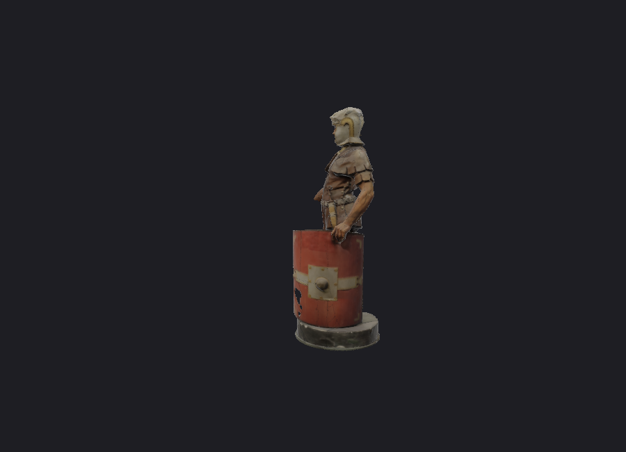
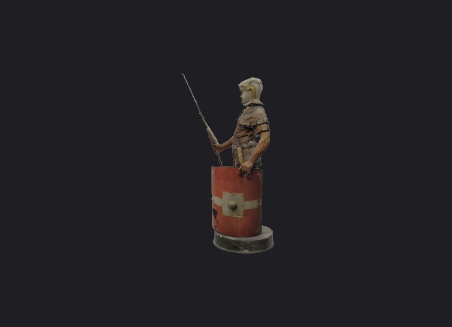

# Issue #3：Editor 场景裁剪修复

基线：`efb3852`（Lighting V1），分支：`fix/editor-scene-clipping`。不合并 main，不执行 Issue #2。

根因是添加小凳子自动 Focus 后，OrbitController 用凳子的 framing bounds 同时计算 far，裁掉仍在视野内的士兵。先提交到工作区的最小测试失败记录见 [failing-test.txt](scene-clipping/failing-test.txt)，修复前真实 GPU 数据见 [baseline.json](scene-clipping/baseline.json)。

修改保留 Focus 的 target、distance、方向和构图；独立用可见场景各实例包围盒的世界角点投影到相机深度，设置有余量的 near/far。忽略隐藏子树及完全位于眼后方的包围盒。每次导航和 Editor 每帧绘制前刷新，覆盖添加、删除、复制、变换、撤销和载入。复用 Mesh 已缓存的局部 bounds，每实例只处理八个角点；兼容旧 demo mesh 时仅首次计算 bounds。

现有 Shot Camera 的显式 near/far 保持不变。独立 OrbitController 默认行为保持兼容，无新依赖、无 Renderer 改动、无第三方源码移植。

## 修改文件

- `mini3d/viewer.py`：可见实例包围盒、场景深度查询和刷新入口。
- `mini3d/orbit_controller.py`：可选深度提供器，区分 framing 与 clipping。
- `mini3d/editor.py`：绘制前刷新；Focus 前更新变换；创建新 Shot 前同步 Editor 裁剪。
- `tests/test_scene_clipping.py`：8 项回归，含 200 倍模型尺寸差、极小/极大比例、导航、变换/复制/删除/撤销、隐藏层级、近处/眼后几何、缓存不扫描顶点、保存载入和显式 Shot 参数。
- `tests/scene_clipping_smoke.py`：真实士兵→凳子添加和 Focus 流程，独立扩大 far 的参考渲染和深度检查。
- 本报告、`docs/scene-clipping/` 测试记录及 PNG、开发进度文档。

## 真实 GPU 对照

Windows / Python 3.8.20 / Intel UHD Graphics 620，900×650 离屏 PNG。完整数据：[修复前](scene-clipping/baseline.json)、[修复后](scene-clipping/results.json)。两个相机除 far 外完全一致；测试独立扫描实际顶点计算几何深度作为判据，生产代码不扫描顶点。

| 场景 | near | far 前 → 后 | 实际几何深度 | 丢失像素前 → 后 |
| --- | --- | --- | --- | --- |
| 添加凳子自动 Focus / 手动 Focus | 0.424407 | 44.310735 → 53.153279 | 35.849927–46.523182 | 1373 → 0 |
| 整场缩小至 0.0001 | 0.0000424407 | 0.00443107 → 0.00531533 | 0.00358499–0.00465232 | 1373 → 0 |
| 整场放大至 100 | 42.440722 | 4431.073489 → 5315.327886 | 3584.992665–4652.318168 | 1373 → 0 |

修复前（矛杆及手臂局部消失）：



修复后（相同构图）：



全部四个 GPU 场景零缺失像素。相对仅扩大 far 的参考，分别有 1、1、2、3 个像素存在颜色差异：24 位深度量化可能改变扫描模型重合表面的胜出三角形，已在断言中限制为极少量孤立像素。另对还原后的视空间深度做比例相关误差检查，全部通过；不以截图相似度代替几何覆盖断言。

## 复现和回归

```powershell
F:/gymenv/python.exe -B -m unittest discover -s tests -v
F:/gymenv/python.exe -B tests/scene_clipping_smoke.py captures/scene-clipping
```

`--baseline` 仅用于修复前代码，要求真实出现裁剪；修复后不应使用该开关。测试使用本地已有 Roman 和 Side Table 资产，不重新分发模型。

224 项单测通过。Ground、Placement V1/V2、Photography、AI API、Lighting、Lighting API、Lighting UI 的真实 GPU 回归结果和日志见 [regression.json](scene-clipping/regression.json) 及同目录各测试名 `.txt`。

## 已知边界与来源

包围盒是保守范围，包括侧面屏幕外但标记可见的几何，因此远处可见实例仍可能扩大深度跨度。跨越眼平面的包围盒采用较小的正 near，无法覆盖数学上的零深度；极端跨度仍受有限深度精度限制。每帧成本与实体数相关，无顶点/三角形遍历；若直接修改 Mesh 顶点，需要同步更新 bounds，与既有几何缓存约定一致。

截图中的 Roman legionnaire 作者 Geoffrey Marchal：[原始发布页](https://sketchfab.com/3d-models/roman-legionnaire-40b87797180148e4bace023b6da0c45a)，[CC BY-NC-SA 4.0](https://creativecommons.org/licenses/by-nc-sa/4.0/)。本目录衍生渲染图遵循同许可，仅非商业用途。Side Table 来源及 CC0 许可见 [模型说明](../model/README.md)。本轮代码是 Mini3D 内部原创修复，沿用仓库许可证。
