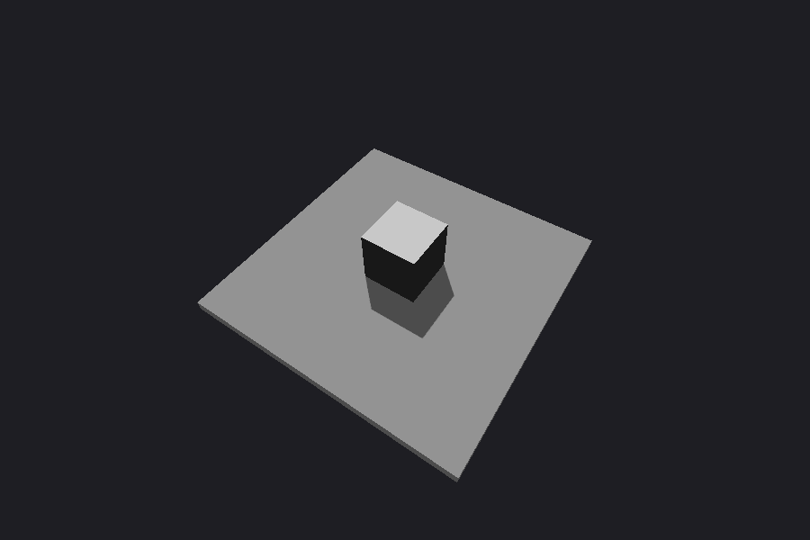
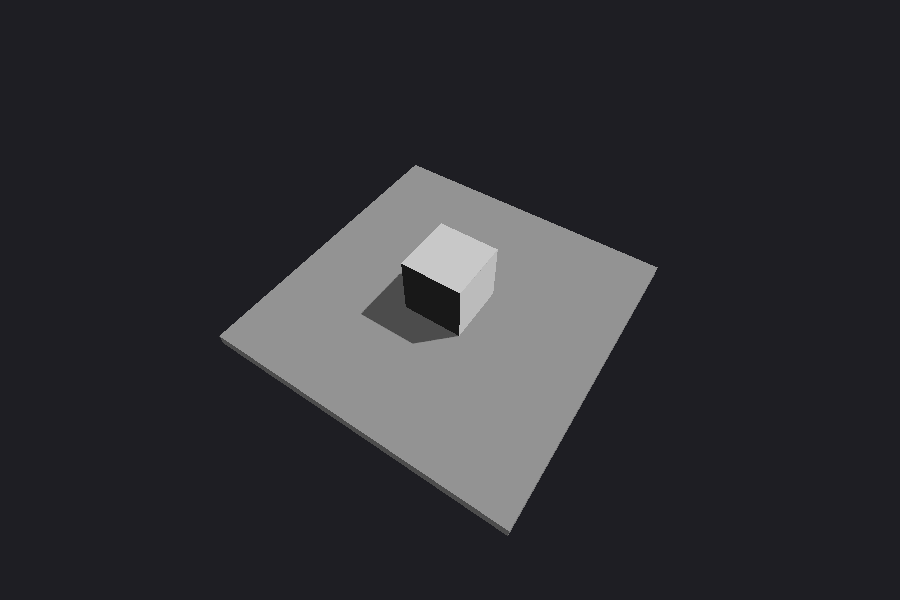
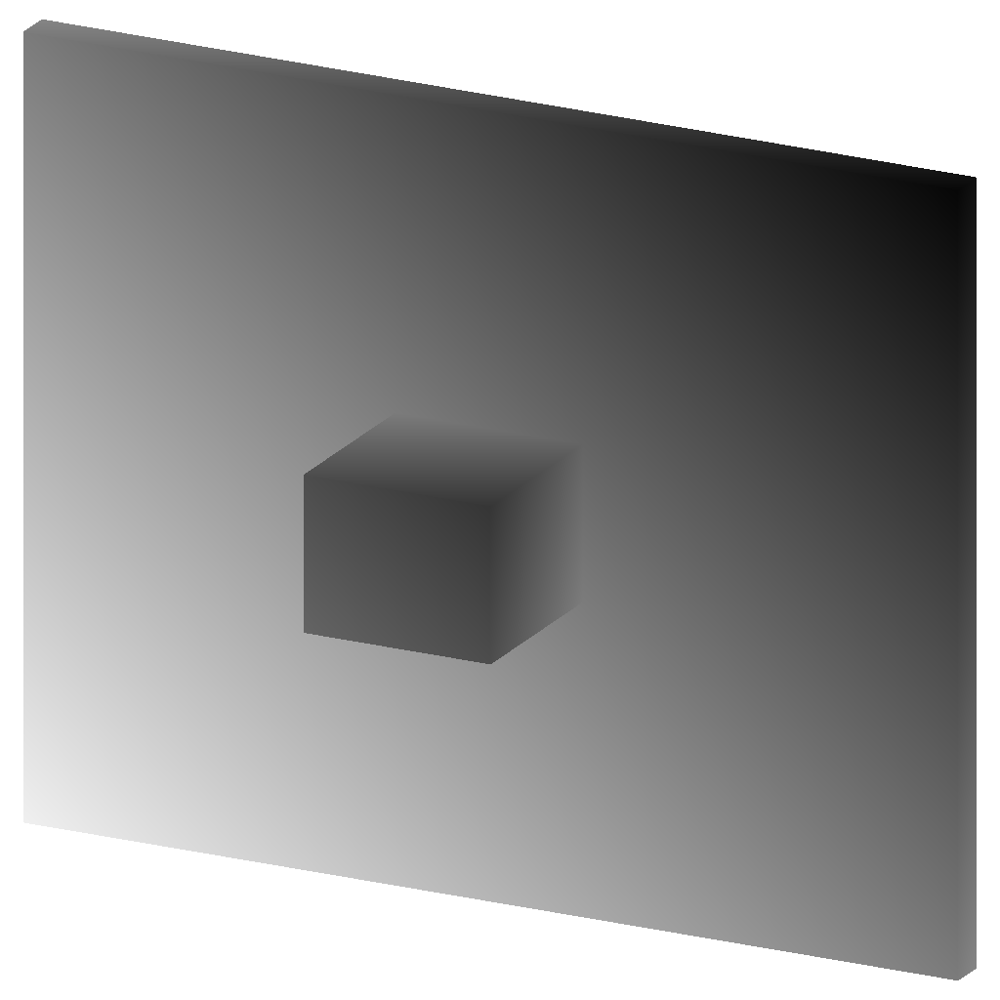
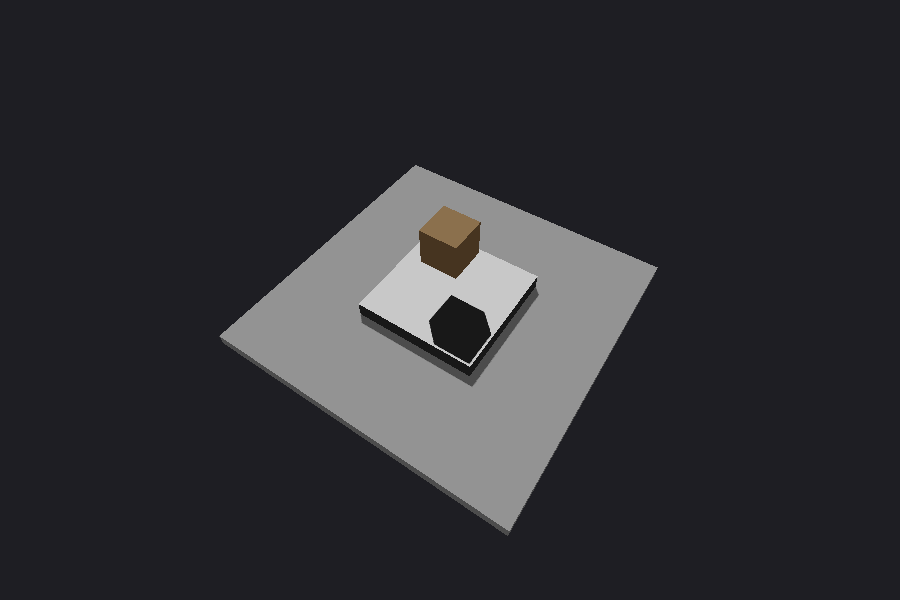
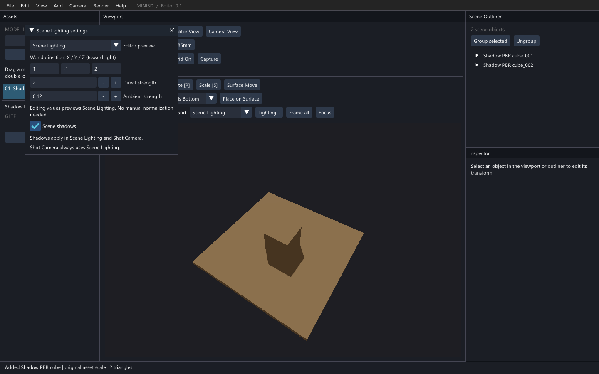

# Shadow Mapping V1 — Issue #2

2026-10-09；基线 `fix/editor-scene-clipping` / `1033e5efcb6548d90ccc2f2b0dd719a78f86e0cd`。
功能分支：`feature/shadow-mapping-v1`。遵循 Issue #2 最新启动评论；不合并 main，本轮结束后停止。

## 操作

Editor 打开 **Lighting…**，选择 **Scene Lighting**，勾选 **Scene shadows**。阴影默认关闭；Studio 预览保持原样，Shot Camera 始终用 Scene Lighting 并沿用阴影开关。只有实体地面/模型接收阴影，Editor Grid 与数学 Placement Plane 不参与深度 Pass，也不会成为照片中的地面。

```python
from mini3d.api import Mini3DAPI
api = Mini3DAPI()
api.set_lighting(mode='Scene', direction=[1, -1, 2], diffuse=2, ambient=.12)
api.set_shadows(enabled=True, resolution=1024, bias=.0005, pcf=True)
print(api.get_shadows())
# 未指定的参数不变；非法参数整组拒绝。
api.set_shadows(enabled=False)
```

JSON dispatcher 支持 `get_shadows` / `set_shadows`，`get_scene_state()` 增加 `shadows`。

```json
{"command":"set_shadows","args":{"enabled":true,"resolution":1024,"bias":0.0005,"pcf":true}}
```

参数：`enabled`、`pcf` 为布尔值；分辨率支持 256/512/1024/2048/4096；`bias` 为有限数值，范围 0–0.05，单位为归一化光源深度。默认 1024、0.0005、3×3 PCF。GPU 超过设备纹理限制时明确报错。关闭阴影保留缓存供再次开启使用，关闭 Renderer 释放资源。

控制入口沿用 Lighting 的事务规则：可在事务中查询，不能在 Placement 事务或 JSON 原子批次内写入阴影设置。Scene JSON 仍为 v3，新增可选 `shadows` 字段；旧文件缺失时恢复为默认关闭。加载时先验证临时 Scene，再发布状态，不会因非法阴影设置产生部分更新。

在拥有当前 GL 上下文且执行过 Scene 阴影渲染后：

```python
renderer.shadow_map.save_depth_png('shadow-depth.png')
# 场景关闭前（GL 上下文仍存活）调用；可以重复调用。
renderer.close()
```

## 移植来源和许可证

上游：[iamyoukou/shadowMapping](https://github.com/iamyoukou/shadowMapping)，固定提交 **`b6aecfd60c68da57c726709d085469245a93e9f1`**。MIT，Copyright (c) 2021, Jiang Ye。完整版权和许可原文保留于 [third_party/shadowMapping/LICENSE](../third_party/shadowMapping/LICENSE)，移植模块也包含来源声明。

| 固定版本源文件 | Mini3D 对应位置 | 改写内容 |
| --- | --- | --- |
| [src/main.cpp](https://github.com/iamyoukou/shadowMapping/blob/b6aecfd60c68da57c726709d085469245a93e9f1/src/main.cpp) | `shadow_map.py: ShadowMap._allocate/render/save_depth_png` | depth24 纹理/FBO、最近邻采样与 slope-scale bias 的 Python/OpenGL 移植；改为真正 depth-only FBO，完整性检查、边界白色、独立生命周期及状态恢复 |
| [shader/vsScene.glsl](https://github.com/iamyoukou/shadowMapping/blob/b6aecfd60c68da57c726709d085469245a93e9f1/shader/vsScene.glsl) | `DEPTH_VERTEX`、`light_matrix`、`SHADOW_GLSL` | 保留 model→world→light clip 的变换关系；使用世界平行光正交拟合，不使用上游透视光源或 Camera 裁剪参数 |
| [shader/fsScene.glsl](https://github.com/iamyoukou/shadowMapping/blob/b6aecfd60c68da57c726709d085469245a93e9f1/shader/fsScene.glsl) | `SHADOW_GLSL.shadowVisibility` | 改写齐次除法、[-1,1]→[0,1]、深度比较和 3×3 PCF；九个采样等权平均，加接收端 bias 与边界判定，返回可见性 |

未移植上游 sceneTex 额外混合、场景整体平移、固定 0.75 暗化或整套渲染器。遮蔽只乘直射光：PBR 的漫反射与 GGX 高光一起乘 visibility，Ambient/AO 项和 Emission 保留。普通 Lambert/Toon 的直射漫反射和 Toon 高光接入；原有 NPR rim/outline 风格效果保留。

## 实现与修改文件

- `mini3d/shadow_map.py`：独立深度 Pass、正交光源矩阵、共用 PCF GLSL、Alpha Mask、深度导出、状态恢复和资源释放。
- `mini3d/gl_renderer.py`：Scene Lit 模式调度深度 Pass，普通几何接收阴影，统一关闭资源。
- `mini3d/material_renderer.py`：PBR 直射可见性，保留第 7 纹理单元及相关状态。
- `mini3d/scene.py`、`lighting.py`：默认配置和原子验证。
- `mini3d/editor.py`、`editor_ui.py`：开关、JSON v3 持久化、关闭 GL 前释放；原有 Camera 裁剪代码保持原样。
- `mini3d/api.py`、`api_dispatch.py`：公开查询/设置和白名单。
- `tests/test_shadows.py`、`shadow_smoke.py`、`shadow_ui_smoke.py`：数学/API/持久化、真实 GPU、真实 Editor 点击测试。
- 本报告、开发进度、`docs/shadows/` 证据、MIT 许可。

复用 Scene 扁平可见实体、Mesh 缓存 AABB、普通和导入材质的现有 VAO/VBO/EBO；深度 Pass 不创建第二份几何缓存。每个实例仅将局部包围盒八角变换到光源空间，正交范围四周留 2% 最大尺寸余量，光源沿 `-scene.light_dir` 看向场景。全部可见几何都参与拟合，变换/尺寸变化每帧更新；完全独立于 Camera。`camera.py`、`viewer.py`、`orbit_controller.py` 相对基线无修改。

## GPU 验收与截图

Intel UHD Graphics 620，Windows，Python 3.8.20，驱动 OpenGL 4.6.0 / 27.20.100.8682；实现使用 OpenGL 3.3/GLSL 330 功能。未在其他 GPU 或严格 3.3-only 驱动验证。

普通 Cube + 实际经 glTF 导入器加载的正常 PBR 实体地面，900×600 原始 PNG。测试模型由本项目原创生成，不含 `KHR_materials_unlit`。修复基线在独立 `1033e5e` checkout 渲染：关闭阴影和 Studio 的像素都与旧版本完全一致。

| 关闭阴影 | 开启阴影 | 改变太阳方向 |
| --- | --- | --- |
|  |  |  |

| 光源深度图 | 模型互投影 | Editor 真实开关 |
| --- | --- | --- |
|  |  |  |

深度图为正交深度 [0,1] 灰度，白色表示空白或远处，不做透视反线性化。[Shot 原始 PNG](shadows/shot.png)、[Alpha Mask](shadows/alpha-mask.png)、[100 实例](shadows/large-on.png)、[大场景深度图](shadows/large-depth.png)。

自动断言通过：

- 世界地面点 `(-1,1,0)` 从 RGB 147 降至 76，未遮挡点 `(2,-2,0)` 仍为 147；根据 Camera 投影跟踪同一个世界点，避免误测屏幕位置。
- Orbit、平移、旋转 Camera 后光源矩阵逐元素完全一致，世界阴影点持续遮蔽；光方向 `[1,-1,2]`→`[-1,-1,2]` 后阴影从 -X/+Y 移至 +X/+Y。
- PBR caster→普通 receiver、普通 caster→PBR ground，两者共享现有绘制缓存。100 个共享导入实例含旋转和平移。
- 场景 0.01×、100× GPU 验收；CPU 正交范围测试另覆盖 1e-5×、1e5×、负缩放和旋转层级。
- 裸露地面多点 on/off 差异 ≤1，没有大面积 acne/条纹；接触附近仍有阴影。PCF 开关、过量 bias 都能触发可测变化。
- Ambient/Emission 在 direct=0 时 on/off 完全一致；Unlit receiver 保持原样；opaque Unlit caster 仍产生几何阴影。
- Alpha Mask 纹理透明半边不投影、不遮挡；实体半边投影。BLEND 不投影。
- Shot PNG 与 Camera View 相同 pass 的原始像素完全一致，Studio Editor 不泄漏到摄影。
- 深度 Pass 恢复 FBO、viewport、program、VAO、buffer、纹理单元、depth/color mask、scissor/stencil/blend/cull/polygon 等状态；尺寸重建和重复关闭通过，无 GL error。
- 真实 SDL/ImGui 点击 `Scene shadows`：开启即时改变像素，再关闭精确恢复。

229 项单测（含 Camera、Ground、Placement、Lighting/API 等）通过；完整 Ground、Placement V1/V2、Photography、AI API、Lighting、Lighting API/UI、Issue #3 裁剪 GPU 回归通过。清单：[regression.json](shadows/regression.json)；各项日志在同目录 `.txt`，专项详细值见 [results.json](shadows/results.json)。

## 性能与边界

专项测试用 GPU `GL_TIME_ELAPSED` 计时，预热 3 帧，采样 12 帧中位数；同时记录 CPU 提交至 `glFinish` 的同步耗时。详见 [性能实测](shadows/results.json)。100 实例另记录带 readback 的整帧时间，不能与纯 GPU 时间直接比较。默认 1024² DEPTH24 名义 3 MiB，按常见 32-bit 对齐预算约 4 MiB；2048² 约 12/16 MiB，4096² 约 48/64 MiB。不是厂商显存计数器实测；无额外场景颜色纹理、无第二份 mesh buffers。

已知限制：

- 单张全场景正交图，无 CSM、阴影距离裁剪或逐实体开关。大范围/稀疏离散模型会分摊 texel 密度；近景精度会下降，不承诺任意大世界都有清晰阴影。100 实例是基础压力验证，不代表复杂 35 万三角形模型达到相同帧率。
- 3×3 PCF 为固定 texel 核，并非物理软阴影。使用双面深度与 `glPolygonOffset(2,4)`，接收端再加可调 slope bias。极薄几何、掠射角、强 normal map 或极端跨度仍可能 acne/peter-panning，需要调分辨率/bias。过量 bias 的示例保留于 `bias-excessive.png`。
- OPAQUE/MASK 可投影，MASK 使用现有 UV、base alpha、顶点 alpha、贴图 alpha 和 cutoff。BLEND 可按现有 PBR 着色接收阴影，但不投影；不实现透射/彩色透明阴影。
- `KHR_materials_unlit` 不接收 PBR 阴影，OPAQUE/MASK 的 unlit 几何可投影；没有改变 Rome River 的 unlit 语义。
- 骨骼沿用加载器静态默认姿态的已有几何结果；没有实时动画或 GPU skinning 阴影。
- 纹理与几何沿用现有不可变资源缓存约定；直接编辑几何需刷新 bounds/GPU cache。禁用阴影不释放缓存，关闭 Renderer 才释放。

## 重跑

```powershell
F:/gymenv/python.exe -B -m unittest discover -s tests -v
# 首次需要旧版本对照文件；可在隔离目录创建基线：
git worktree add --detach captures/shadow-baseline 1033e5e
F:/gymenv/python.exe -B tests/shadow_smoke.py docs/shadows --baseline
F:/gymenv/python.exe -B tests/shadow_smoke.py docs/shadows
F:/gymenv/python.exe -B tests/shadow_ui_smoke.py docs/shadows
```

`--baseline` 仅渲染旧版本对照，不启用阴影。阴影图与测试 PBR 模型均为本项目原创测试场景的实际 GPU 输出。
