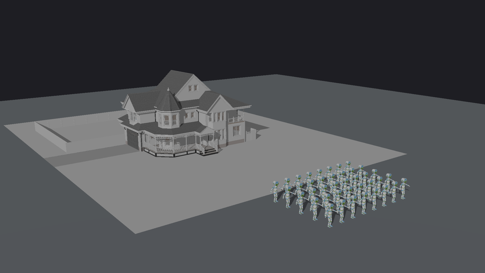
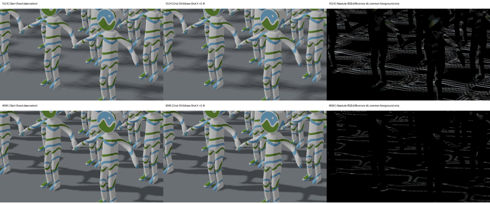

# 开放许可复杂模型：House＋40 CesiumMan 补测

2026-10-10；引擎基线 `feature/shadow-camera-fit-v1` @ `7aa2109076cbc90f5cf67f0f6dc5b429414b0929`。仅增加测试和证据，不改生产引擎。

## 结果

**已经从公开仓库下载真实模型并完成测试。** 建筑、纹理和静态人物骨骼姿态成功导入；40实例共享网格、阵列撤销／重做及场景保存／重载通过。复杂模型中再次复现动态阴影视域造成的固定世界阴影明暗变化；4096缩小受影响区域，未消除。纯CPU拟合成本约27～39ms，不能继续采用简单场景的1.5～2ms预期。

本轮是 **Victorian House＋40 CesiumMan**，不是缺失的原 Rome＋40 Roman Legionnaire。实际提交约201万三角形、313绘制实体、1508层级节点。CesiumMan每人4672三角形，原士兵每人589879三角形；本轮总三角形负载约为原Rome阵列的1/12。因此可以补充真实资产的CPU规模和阴影时序证据，不能据此给原Rome场景的GPU帧率验收。



[人物近景1024](people-close-1024.png) · [人物近景4096](people-close-4096.png) · [性能远景4096](overview-4096.png)。摄影构图另外调整了机位与光照；性能机位没有随之改变。远景性能照片下方部分人物出框，这是测试构图，不作为产品缺陷。

## 资产与可复现布景

| 资产 | 原作者与许可 | 导入几何规模 |
|---|---|---:|
| Victorian Style House，glTF core | MrChimp2313，CC0；PBRT资源整理Benedikt Bitterli，glTF转换ErfanMo77 | 272 primitive、1818777三角形、31材质、1嵌入PNG |
| CesiumMan GLB | Cesium，CC BY4.0；Cesium标志另有商标说明 | 1 primitive、4672三角形、22原始node、1skin、1animation、1嵌入JPG |
| 引擎 builtin:ground | Mini3D原有真实地面网格 | 1 primitive、2三角形 |

资产来源：[glTF Research Scenes](https://github.com/ErfanMo77/gltf-research-scenes)，固定版本 `f61371ee556a5e1f0e5c697bcbdfb95ca756bcfd`；[Khronos CesiumMan](https://github.com/KhronosGroup/glTF-Sample-Assets/tree/edc7c9e67c639d230715049ee31f9a96a6babbbe/Models/CesiumMan)，固定版本 `edc7c9e67c639d230715049ee31f9a96a6babbbe`。许可原文：[House](house-license.txt)、[CesiumMan](cesium-license.md)。截图中人物是CesiumMan的静态默认骨骼姿态，不是运行中的动画。

House core是标准glTF，没有必需扩展，无Draco。二进制49,583,366字节；GitHub raw返回的是LFS指针，脚本从固定版本media端点取得真实数据，并验证SHA256 `ba2d9875b4265ae704200f16758224e7c92107828a0bf3f597344ff26bc793aa`。CesiumMan GLB为438,044字节。三份模型文件都有固定SHA检查，全部来源、大小与SHA见 [results.json](results.json)。模型文件不提交仓库，复现时自动下载。

House含玻璃的core近似材质，原PBRT环境和远光仅作为metadata保留；本测试自行配置Mini3D Scene方向光，不把源路径追踪器的GI、折射或环境照明效果当作本引擎的应有输出。[源转换报告](house-conversion.yaml)。

布景通过真实Mini3DAPI执行：House最长XY跨度归一到40，XY中心 `[0,10]`，底部Z=0并锁定；真实地面尺寸100。人物高度1.7，阵列第一人XY `[-4.2,-17]`，5行×8列，间距 `[1.2,1.4]`，40人数包含源人物。场景有42根对象，共享274份网格；39复制人物没有复制不可变几何资源。

[保存的Scene v3](house-40.scene.json) 使用项目相对资产路径；在仓库根目录按脚本默认下载路径复现后可加载。其灯光 `[-3,-2,3]`、ambient=.3、diffuse=3；PCF=true、bias=.0003。两个性能Shot均16:9、1920×1080、near=.05、far=400：

- 远景：机位 `[-25,-35,18]`，目标 `[0,5,3]`，35mm。
- 人物近景：机位 `[10,-26,5]`，目标 `[0,-14,1]`，50mm。

## CPU拟合与层级成本

云端Linux / Python3.12.14 / AMD EPYC9V74，OPENBLAS_NUM_THREADS=1、OMP_NUM_THREADS=1。每组5次预热、51次采样，交替测全场景和Shot拟合；新增成本为配对差值中位数。CPU计时时未并行运行其他本次基准。下表单位ms，中位数；P95与极值完整保留在JSON，存在云端运行波动。

| 场景 | 绘制实体 / 层级节点 | 机位 | 旧全场景 | 新Shot拟合 | 配对新增 | Scene.update |
|---|---:|---|---:|---:|---:|---:|
| House＋地面 | 273 / 548 | 远景 | 2.94 | 20.31 | 17.28 | 7.86 |
| House＋地面 | 273 / 548 | 近景 | 3.01 | 31.93 | 28.60 | 8.49 |
| 加1人物 | 274 / 572 | 远景 | 3.35 | 22.37 | 18.91 | 8.94 |
| 加1人物 | 274 / 572 | 近景 | 3.11 | 33.55 | 30.21 | 8.85 |
| 加40人物 | 313 / 1508 | 远景 | 3.80 | 27.38 | 22.99 | 22.37 |
| 加40人物 | 313 / 1508 | 近景 | 3.81 | 38.94 | 34.90 | 24.38 |

40人远景Shot拟合P95=42.80ms，近景P95=45.67ms。近景的626次包围盒交集调用中，有106次部分相交、167次快速排除、353次快速包含；远景只有5次部分相交。这说明真实包围盒与视锥关系会明显改变成本，仅凭实体总数不能预测具体耗时。两组均没有fallback。

House单独就贡献主要拟合成本。人物深层级也增加Scene.update：约8ms上升到22～24ms；展平列表约.10ms。Scene.update在拟合和下述Shot计时之外，不能遗漏后再称完整交互帧率。建议优化静态世界／光源包围盒缓存、批量平面分类、Python每实体调用与数组分配；保留画外caster的保守覆盖。

## 完整Shot同步墙钟

实际GL renderer是 **llvmpipe (LLVM20.1.2,256bits)，软件OpenGL4.5**，LP_NUM_THREADS=1。这不是用户的Intel UHD620或MX130，以下绝对耗时不能当作用户GPU性能或FPS。

每模式3次预热、9次计时；开始和结束均glFinish，排除首次资源上传、PNG读回／编码和Scene.update。旧全场景路线只将shadow矩阵计算的camera参数改为None，其他绘制路径一致。三种模式按固定顺序运行，较小差值可能受漂移影响；不是纯GPU timer。

| 机位 / ShadowMap | 关闭阴影 ms | 旧全场景 ms | 新Shot拟合 ms |
|---|---:|---:|---:|
| 远景 / 1024 | 285.42 | 500.66 | 488.91 |
| 远景 / 4096 | 264.91 | 532.50 | 571.58 |
| 近景 / 1024 | 231.02 | 461.43 | 536.91 |
| 近景 / 4096 | 229.82 | 541.88 | 577.95 |

这里可靠的用途是证明真实网格／纹理已经过完整绘制，比较不同路径的规模；远景1024略快不能解释为CPU拟合变便宜，纯CPU数据已独立证明其额外开销。未从这些数值推断独立GPU瓶颈。

## 连续镜头阴影

人物近景横移：摄影机与目标一起沿X移动0.4世界单位，保持旋转和焦距，每个分辨率33个采样机位；相邻步长.0125。共66个动态采样机位，同时生成实际移动Shot和固定观察机位诊断照片。视频按15fps组织采样，仅为播放速度，不是引擎实测帧率。

- [实际移动Shot对比视频](moving-shot.mp4)：左1024、右4096。
- [固定观察机位阴影视频](fixed-shadow-motion.mp4)：正常画面投影不变，只有shadow矩阵跟随移动Shot，用于分离正常相机运动。
- 固定相机重复3次，完整RGB精确一致；覆盖整段路径的固定union-fit重复3次，完整RGB精确一致。两个分辨率均通过；GL错误为0。

### 排除视野和拟合边缘

固定观察机位全图差异可能含观察机边缘离开moving-fit覆盖的像素，因此**不把全图统计直接当作摄影抖动面积**。另从固定相机真实GL深度反投影像素中心到world，只保留每个移动视锥内部2%余量、所有shadow矩阵内XY有1.5texel余量且Z有效的共同接收区域。

人物／地面前景还限制world X∈(-7,7)、Y∈(-19,-9)、Z∈(-.05,2.1)，排除建筑透明玻璃混合颜色缺乏唯一深度的问题。每组共同像素1,931,715，其中前景像素 **1,098,787**。两份 [1024 mask](common-mask-1024.npz)、[4096 mask](common-mask-4096.npz)保存二维布尔数组，不依赖挑选差异最大的像素。

| 分辨率 | 前景相对首帧最大变化像素 | 其中任一通道差>8 | 差>16 | 最大通道差 |
|---|---:|---:|---:|---:|
| 1024 | 261,400（23.79%） | 95,948（8.73%） | 11,106 | 34 |
| 4096 | 73,504（6.69%） | 31,027（2.82%） | 4,848 | 41 |

各列分别取逐帧最大值，未必同一帧。这里只让拟合矩阵变化、场景与画面几何都静止，因此共同前景的阴影变化不能归因普通相机运动。4096减少整体变化区域，但局部单步变化不一定更小：相邻帧差>8的最大像素数1024为17,372，4096为19,886。不能承诺高分辨率消除闪烁。共同视锥内也不保证每个moving view都无遮挡可见，固定观察统计仍是诊断证据，真实移动视频用于观察摄影表现。



裁剪坐标 `[840,680,1480,1040]`；左右是原始生产着色器像素，右侧仅作差异可视化并屏蔽mask外像素，不是引擎原图。光照空间extent在这条路径中约X=43.14～43.40、Y=82.23～82.35、Z=78.90～79.19；中心和尺度都变化。建议同时稳定XY尺度与中心texel snapping，而不是仅增加分辨率。Z和世界尺度bias的稳定仍需另行验证。

## 操作与保存验收

40人Formation一次撤销恢复3个根对象（House、地面、源人物）；重做恢复42个根对象。保存Scene v3并在同一API与资产缓存中重载：用户状态、实体／网格数量均相同，完整1920×1080 RGB变化像素=0。随后在另一测试进程成功加载该项目，完成共同接收区域诊断与摄影构图；这里没有额外宣称跨进程逐像素一致。

8个现有 `test_shadow_camera_fit.py` 专项测试再次通过。未重复整个仓库全量测试。本轮没有确认新的导入、复制、保存或GL错误；阴影时序稳定和CPU拟合规模开销仍是已确认的改进项。

## 复现

在含本报告的测试分支，安装 `requirements.txt` 与Pillow；运行 [开放资产测试脚本](../../../tests/open_assets_shadow_audit_20261010.py)：

```powershell
$env:OPENBLAS_NUM_THREADS="1"
& F:/gymenv/python.exe -B tests/open_assets_shadow_audit_20261010.py --download
```

默认51次CPU、9次完整Shot、33个横移机位、1024与4096。模型和原始帧在 `captures/open-assets-20261010/`；已下载时跳过下载并检查模型SHA。`--refine-only` 仅从已完成结果和保存场景重做共同区域诊断，不重测性能。

```bash
LP_NUM_THREADS=1 OPENBLAS_NUM_THREADS=1 OMP_NUM_THREADS=1 PYOPENGL_PLATFORM=egl SDL_VIDEODRIVER=offscreen SDL_AUDIODRIVER=dummy python -B tests/open_assets_shadow_audit_20261010.py --download
python -B -m unittest discover -s tests -p test_shadow_camera_fit.py -v
```

Windows会使用实际选中的GL context；记录中的renderer为准。云端软件GL和用户实际GPU应分别保留结果。原Rome基准仍可用之前的 [原资产入口](../../../tests/shadow_fit_performance_20261010.py)，缺原文件时明确退出，不会自动替换成本轮模型。
