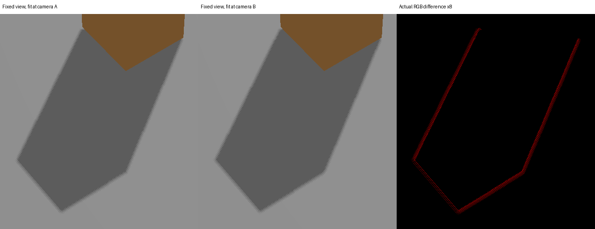

# 连续摄影机阴影稳定性与复杂实体拟合性能补测

2026-10-10；测试 `feature/shadow-camera-fit-v1` @ `7aa2109076cbc90f5cf67f0f6dc5b429414b0929`。本提交只增加测试和证据，没有改引擎代码。

## 结论

1. **已实测连续 Shot 移动会使固定世界阴影边缘明暗变化。** 1024 的轮廓抖动/闪烁较明显，4096 缩小受影响的区域，但未消除。静态 22 张照片不足以覆盖此问题。
2. **新增 CPU 成本确实随网格实体数量上升，不能外推简单场景的 1.5～2 ms。** 本机合成 241 个渲染实体时拟合约 17 ms；305 个约 28～31 ms。这里只测试包围盒数量/层级，不是真实 Rome GPU 性能。
3. **真实 Rome＋40 士兵仍未验收。** 两个原始 GLB 在当前工作区、仓库及已保存资产包中缺失；下载端需要授权或不可达。已交付真实资产基准入口，缺资产会明确退出 2，不自动替换。

原始数据：[连续镜头摘要](motion-summary.json)、[全逐帧数据 gzip](motion-raw.json.gz)、[CPU 原始结果](cpu-proxy.json)、[真实资产缺失记录](real-assets-status.json)。

## 连续镜头测试设计

采用项目 make_box 生成 200×200 地面及 1×1×2 遮挡方块，灯光、材质、几何均静止；50mm/4:3、1920×1440，near=.05、far=400，PCF=true、bias=.0003。

三条路径，分别测 1024 与 4096：

- **横移**：摄影机 `[7,9,13]` → `[7.2,9,13]`，目标 `[.6,.5,0]` → `[.8,.5,0]`，固定旋转，121 帧。可单独观察 ShadowMap 网格平移，XY 范围尺寸基本不变。
- **推进**：摄影机 `[7,9,13]` → `[6,7.5,10]`，保持目标 `[.6,.5,0]`，61 帧。同时覆盖尺度变化。
- **低太阳高度横移**：同横移路径，灯光改 `[-3,-2,.8]`，61 帧；其余两组光 `[-3,-2,3]`。

合计 **486 个动态采样帧**，另有预热、静态重复、锁定拟合与正常照片/诊断渲染。不是交互帧率测试。

### 如何排除正常相机运动

- 读取实际 OpenGL ShadowMap 深度，按生产着色器的 float32 光源矩阵、GL_NEAREST、3×3 PCF 和 slope bias，在固定世界地面点重放 visibility。使用 256×256 区域网格及两条 4096 点剖面，只统计整条路径都在视锥内的点。它们是潜在接收点，没有做遮挡剔除；采样比例不能解读为画面面积或肉眼闪烁频率。
- 固定摄影机重复渲染三次，结果精确一致。
- 把整条路径实际拟合区域合并为一张固定 light matrix，在起点/中点/终点重拍深度，固定世界点结果精确一致。锁定的是覆盖整段路径的拟合，不是低精度全场景算法。
- **另用完全相同的生产 Shot 着色器，固定观察机位，只让 ShadowMap 矩阵跟随移动的摄影机。** 这使普通画面投影和几何像素保持静止。实际 RGB 差异集中在阴影轮廓，交叉确认深度重放结论。诊断图采用测试注入；不是产品中的新摄影模式。

### 结果

下表为固定观察机位的原始 RGB 渲染中，相对首帧的最大变化像素数；每张 2,764,800 像素。横移每四帧取一张诊断，共31张；推进/低太阳每四帧及末帧，共16张。

| 路径 | 1024：最大变化像素 / 最大单通道差 | 4096：最大变化像素 / 最大单通道差 |
|---|---:|---:|
| 横移 | 6,943 / 30 | 1,821 / 30 |
| 推进 | 5,667 / 30 | 1,448 / 40 |
| 低太阳横移 | 7,452 / 14 | 1,856 / 9 |

4096 下变化主要被压缩到更窄边缘，不能仅凭极少数点的最大变化幅度判定它与1024同样严重。1024 横移的固定世界采样有2,230个点发生变化；4096为613个点。所有六组固定机位/锁定拟合控制均精确稳定，GL error 均为0。



左右原图均为生产着色器输出；第三列只用于显示绝对 RGB 差异，放大8倍，不是引擎原图。差异发生在投影轮廓附近。

- [固定世界接收区域动画：左动态拟合、右锁定对照](world-shadow-motion.mp4)（采样可视化，非摄影画面）。
- [固定观察机位的实际着色器动画](fixed-view-shadow-motion.mp4)。
- 正常摄影机原始照片：[A](shot-camera-a.png)、[B](shot-camera-b.png)。

### 原因与稳定化方向

`mini3d/shadow_fit.py::receiver_matrix` 每帧重算 XY 中心、范围和 Z 深度；`shadow_map.py` 使用 nearest 深度采样，PCF只是9次 nearest。横移测试中 XY extent 不变，但固定世界点每帧约漂移 `[.08985,.02918]` 个1024 texel，阴影轮廓反复穿越采样边界。

可优先尝试稳定 XY 尺度/分档或余量迟滞，再以固定光源坐标中心做 texel snapping；只有中心 snapping、仍每帧改变尺度，不能充分稳定推进/旋转。对照证明覆盖整段镜头的固定拟合能消除本测试变化；这是诊断证据，不代表任意固定区域都不会截断阴影。要保留画外投影物。

另有 [CPU 几何探针](caster-z-summary.json)：垂直光、顶视摄影机，画外高空盒首次进入接收 XY 棱柱时，摄影机 X 从 .044 到 .0445，Z extent 从2.344升到22.048，归一化 bias 对应世界距离约增9.4倍。**此项只确认深度范围跳变机制，没有将该几何例子报成已看到的 GPU 闪烁。** 可考虑稳定深度包围范围/世界尺度 bias；不应删除画外 caster 来消除跳变。

## CPU 复杂度测量

Linux / Python3.12.14 / AMD EPYC 9V74，OPENBLAS_NUM_THREADS=1。5次预热、51次采样，交替测旧全场景与新 Shot 拟合，报告中位数；新增成本用配对差值中位数，不是两个中位数直接相减。计时过程中未并行运行其他本次渲染测试。

**全部为自制方块的合成层级场景。** “40×6部件”用于对应约240个展平网格的数量级；没有复制真实士兵 AABB、实际三角形或罗马建筑层级，不能称为 Rome 或真实士兵性能。

| 合成场景 | 渲染实体 | 旧全场景拟合 ms | 新摄影拟合 ms | 配对新增 ms |
|---|---:|---:|---:|---:|
| 地面＋方块 | 2 | 0.094 | 0.532 | 0.415 |
| 1个六部件对象＋地面 | 7 | 0.142 | 0.833 | 0.694 |
| 40个六部件对象＋地面 | 241 | 2.577 | 17.121 | 14.471 |
| 40对象，层级深度4 | 241 | 2.495 | 17.391 | 14.753 |
| 40对象＋64个背景部件 | 305 | 3.372 | 28.446 | 25.261 |
| 同上，近景穿过视锥边界 | 305 | 3.353 | 30.806 | 27.436 |
| 100个六部件对象＋地面 | 601 | 6.009 | 48.555 | 41.898 |

例如305实体背景场景执行610次交集调用，54次走部分相交的完整候选点路径；近景67次。241实体全入镜场景仍执行482次交集调用，大多数是快速包含路径。说明仅加“部分相交优化”不会解决全部每实体 Python/NumPy 调用成本。

深层级对拟合自身影响较小，因为拟合拿到的是已展平网格列表；但该合成例的 Scene.update 中位数从3.64增加到5.53 ms。它不包含在上表的拟合耗时内，flatten只约.02～.03 ms。真实布局、部分相交数量及 CPU 会改变具体数值；不能把本云端机器的 ms 换算为用户显卡 FPS。

建议先缓存静态实体世界包围盒/光源坐标、做批量平面分类和减少每实体小数组分配。完全相同摄影机、灯光、实体变换时可缓存完整拟合；连续移动则需正确失效。性能优化应保持接收范围与画外 caster 的保守覆盖。

## 真实 Rome＋40 士兵：待本机执行

仓库 manifest 记录真实士兵有6 meshes、589,879三角形，40人约23,595,160三角形，再加 Rome。shadow_fit 不扫描三角形，但绘制耗时会受它们影响。因此 CPU 拟合数值和完整 Shot 同步 wall 耗时必须分开报告。

原文件保留在：

- `model/08_rome_river/rome_river_side.glb`
- `model/05_roman_soldier/roman_legionnaire.glb`

[真实资产基准脚本](../../../tests/shadow_fit_performance_20261010.py) 会记录 SHA、实际顶层/层级/展平实体数、提交三角形数、纯 CPU 拟合、Scene参数，以及1024/4096、远景/军团近景的阴影关闭/旧全场景/新摄影拟合三种完整 Shot 同步 wall。排除 PNG编码和首次上传。没有纯 GPU time 宣称，没有FPS宣称。

默认复现布局将 Rome 最长 XY 尺寸设40、士兵高度1.7、5×8含源士兵，保持模型文件不变。这是明确的性能场景，不冒充此前用户布景验收；可以用所得照片检查遮挡/场景差异后再调整。

```powershell
$env:OPENBLAS_NUM_THREADS="1"
& F:/gymenv/python.exe -B tests/shadow_fit_performance_20261010.py real
```

可用 `--rome` / `--soldier` 指定原文件；`--gpu-samples 9 --cpu-samples 51 --resolutions 1024 4096` 是默认值。数据/照片写在 `captures/shadow-performance-20261010/`。GL context可能选择Intel而非MX130，以结果中的renderer为准。

已用基础 glTF 执行远景/近景、关闭/全场景/新拟合三路线，确认真实基准脚本完整接线与GL错误检查：[流程验证](harness-verification.json)。它只是脚本 smoke，未列入真实模型性能表。

## 复现本轮测试与验证边界

[连续镜头脚本](../../../tests/shadow_motion_audit_20261010.py) 另需 Pillow（原引擎 requirements 以外的测试图片依赖）。

```bash
python -m pip install -r requirements.txt Pillow
LP_NUM_THREADS=1 OPENBLAS_NUM_THREADS=1 OMP_NUM_THREADS=1 PYOPENGL_PLATFORM=egl SDL_VIDEODRIVER=offscreen SDL_AUDIODRIVER=dummy python -B tests/shadow_motion_audit_20261010.py
OPENBLAS_NUM_THREADS=1 OMP_NUM_THREADS=1 python -B tests/shadow_fit_performance_20261010.py cpu-proxy
python -B tests/shadow_motion_audit_20261010.py --z-probe-only
python -B -m unittest discover -s tests -p test_shadow_camera_fit.py -v
```

8个现有阴影视域专项单元测试通过；本轮未重复全部251项或罗马布局验收。最终连续测试采用 llvmpipe 软件 OpenGL、LP_NUM_THREADS=1，并在深度读回前显式 glFinish。早期未显式同步的软件驱动采集出现固定矩阵控制不一致，未作为结果；其驱动/同步原因没有专项定位。最终六组控制全部通过，说明上述变化在受控运行中可归因动态拟合。仍需用户实际GPU复测抖动幅度与显示感受。

本报告没有证明任意旋转、空视野 fallback、所有复杂模型都无新伪影，没有改 Renderer、材质、CSM/GI 或资产许可。
