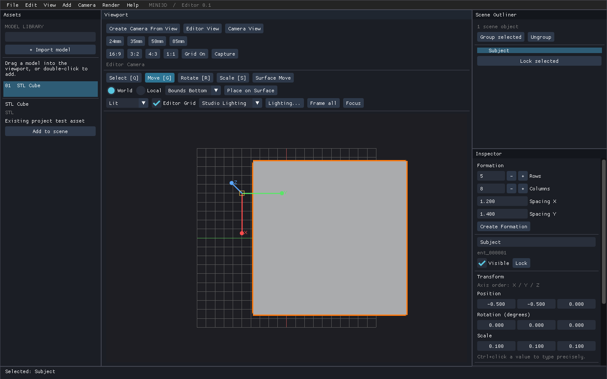
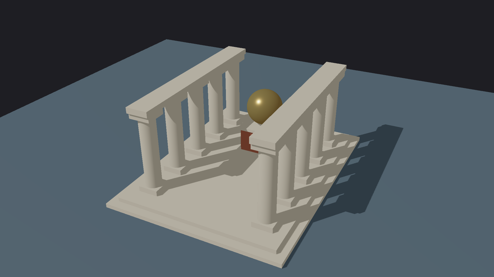
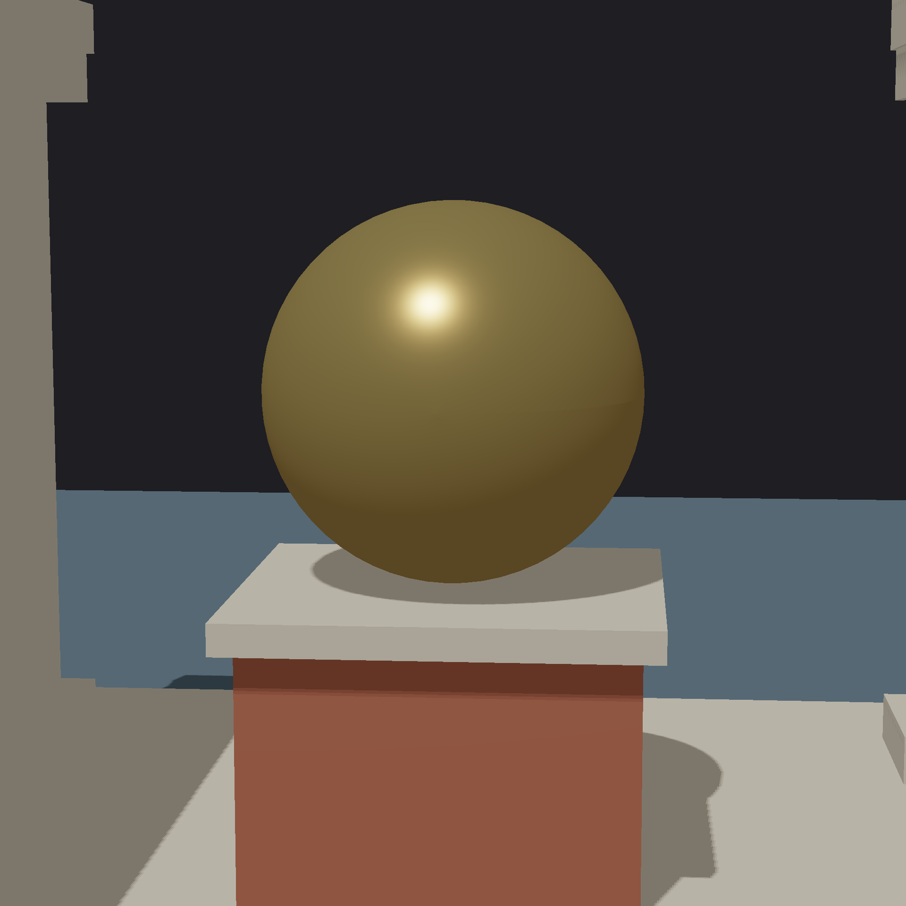
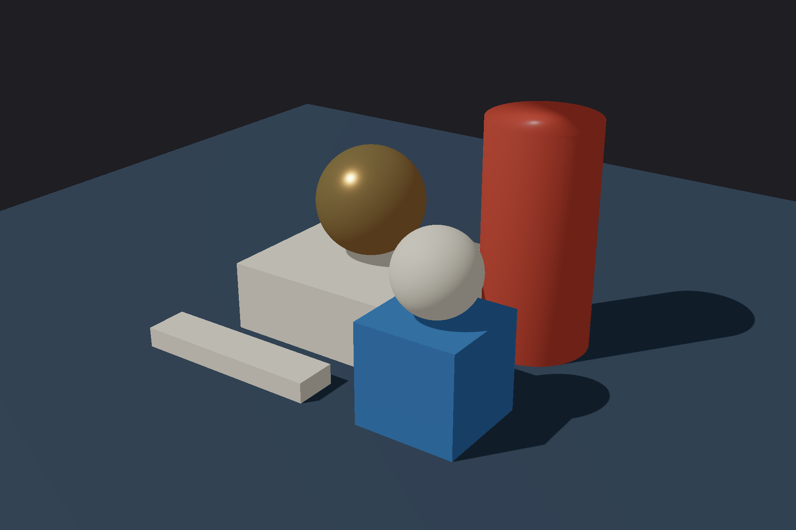
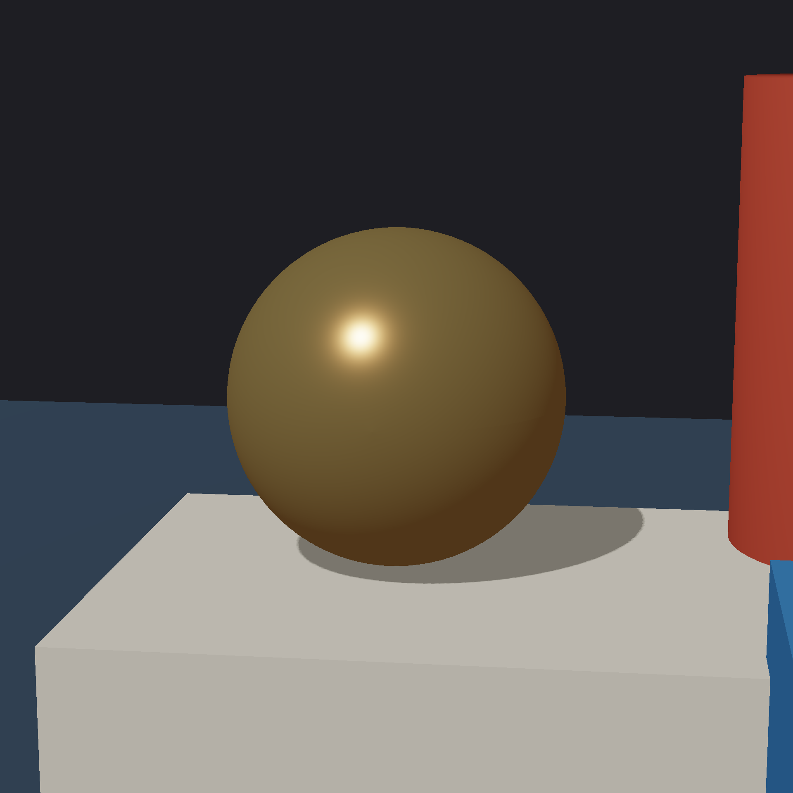
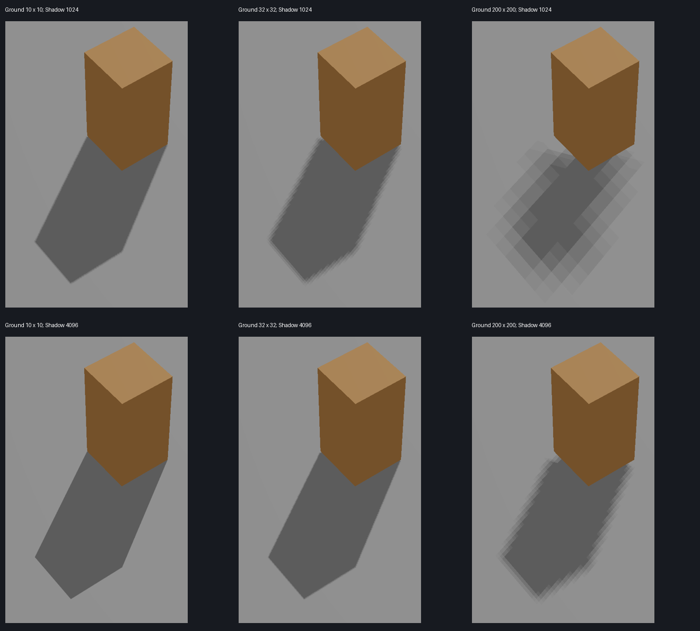

# Mini3D 摄影与功能测试归档 · 2026-10-10

测试基线：`feature/shot-camera-persistence`，提交 `7cb7719868b4fbdfe16ff89b4e2b6db092b44747`。本分支增加测试、报告与证据，没有修改生产代码。请从本测试分支创建修复分支；仓库当时的 `main` 尚不包含这些编辑器功能。

## 给网页版 Codex 的修复入口

**确认 1 个 bug：Move Gizmo 按住左键拖动，跨入 Assets 面板后按 Esc，位置不能恢复且已新增 Undo。**

1. 阅读 [逐帧复现报告](gizmo-ui-reproduction.md) 和 [原始检查及事件状态](ui-result.json)。
2. 检查 `mini3d/editor.py::Editor.handle_event()` 中 UI 捕获鼠标时调用 `self.gizmo.finish()` 的分支，以及 Esc 取消分支。
3. 普通面板越界应暂停几何更新并保留手势，直到左键释放或 Esc。沿用已有焦点丢失规则，单独评估模态场景。
4. 最小范围修复，并验证视口内 Esc、跨面板 Esc、跨面板松开：取消应恢复位置、不增加历史；松开应只提交一次。当前脚本已有前两种 Gizmo 路线和 Surface Move 松开对照，建议补充 Gizmo 跨面板松开检查。
5. 保留文本输入/UI 捕获、Surface Move、Camera View 输入隔离及保存重载行为。运行相关单元测试和下面的实际 UI 回归。提交并推送修复供审阅。

原始 UI 实测 65 条断言：63 通过，2 失败，均属于同一 bug；39 条为逐帧 OpenGL 检查。实际 SDL/ImGui/OpenGL 事件循环，没有伪造 UI 捕获。可用 Undo 恢复，未发现文件丢失或崩溃。

| 视口内移动 | 保持左键进入 Assets | Esc 后仍未恢复 |
|---|---|---|
|  |  |  |

## 两轮测试结果

| 范围 | 结果与证据 |
|---|---|
| 既有全量单元测试 | `Ran 239 tests`, `OK (skipped=8)`；见 [原始日志](unit.log)。跳过与未下载可选资产有关，包含子测试，不换算为 231 通过。 |
| API 摄影/摆放流程 | [35 项断言全部通过](api-result.json)：阵列、事务回滚、锁定、机位/比例、保存重载、Undo、dispatcher。 |
| 摆放组合 | [4 项组合检查通过](placement-result.md)；额外复跑 59 项旧测试与全量回归重叠，不累加。 |
| 编辑器使用 | 第一轮真实编辑器 45 帧回归通过；第二轮 UI 回归确认上述取消 bug，其余摄影输入隔离、Grid、A→旧 B→A 场景切换通过。 |
| 建筑摄影 | 38 实例，32 成员柱廊组；[第一轮报告](round-one.md)、[参数](colonnade-session.json)。保存重开照片逐像素一致。 |
| 摄影机跨进程持久化 | [独立重启检查](restart-result.json)：1920×1440 重拍一致，导航后仍一致。 |
| 静物摄影 | 7 实例、4 个机位；[第二轮报告](round-two.md)、[参数/检查](still-life-session.json)。保存重开一致，删除圆柱改变照片、Undo 恢复原图。 |
| 尺度变化 | 全场景及相机/裁剪共同缩放 0.01/100，只有 51/49 个像素变化（每图 2457600 像素），无可见模型缺失；非逐像素一致。 |
| 阴影质量 | [六组受控实拍](shadow-quality.md)、[矩阵测量](shadow-measurements.json)：大地面稀释单张全场景阴影图精度，属于已知画质限制。 |

摄影通过 API 构建场景，再在实际编辑器查看及做交互回归。模型由项目方块/圆柱/球生成器自制，不依赖下载模型。照片是引擎原始 PNG 输出，未经后期修图。






## 阴影画质反馈（单独评估）



上排 1024、下排 4096；三列地面边长 10/32/200。同一主体、光线、机位、bias、PCF。大地面 200 在 4096 下仍比地面 10 在 1024 下粗。未来可考虑摄影阴影范围或可见接收区域及投影物的联合拟合；须保留画外投影物，避免阴影截断。此项不是新的功能 bug，也没有要求重写 CSM/GI。模型轮廓抗锯齿另属输出问题，本次未做专门对照。

## 复现命令

安装原项目 `requirements.txt` 中的依赖。无 OpenGL 的纯逻辑检查：

```bash
python tests/api_photography_workflow_20261010.py
python tests/audit_placement_20261010.py
python -m unittest discover -s tests -v
```

实际 UI 自动回归在 Linux EGL / SDL offscreen 环境验证；归档脚本移动到 `tests/`，只调整根目录/输出目录，并补充失败退出码。原始采集脚本返回 0；归档版本存在失败则返回 1。归档后已做语法及改动核对，当前上传环境缺少图形依赖，没有重新执行该完整图形流程。

```bash
PYOPENGL_PLATFORM=egl SDL_VIDEODRIVER=offscreen SDL_AUDIODRIVER=dummy python -B tests/ui_photography_journey_20261010.py
```

未修复基线预期 2 条失败；修复后原有 65 条检查应全部通过。检查数据和截图写到被 git 忽略的 `captures/second-session/ui-study/`。Windows 可直接按上述报告的普通编辑器步骤复现。

重新生成全部基础 glTF、可编辑场景和照片：

```bash
python tests/photographer_session.py
python tests/photographer_session_two.py
python tests/audit_shadow_precision_20261010.py
```

前两个摄影脚本在 Linux 无 DISPLAY 时自动选择 offscreen/EGL；阴影脚本默认该环境。随后在有显示环境中打开场景：

```bash
python tests/open_photographer_session.py 02_sanctuary
python tests/open_second_session.py 01_geometry
```

## 覆盖边界

原测试环境：Python 3.12、Mesa llvmpipe 软件 OpenGL。拍照耗时含 PNG 输出，不是 FPS，不推断用户显卡性能。第二轮未重复全量 239 项测试。复杂罗马资产、透明/动画、其他导入格式及大规模士兵性能尚未验收；不据此关闭已有罗马集成 issue。Unlit 与负 Scale 被拒绝是现有能力边界，未报为新 bug。基础体直接添加、多命名机位、材质编辑是创作体验建议。
