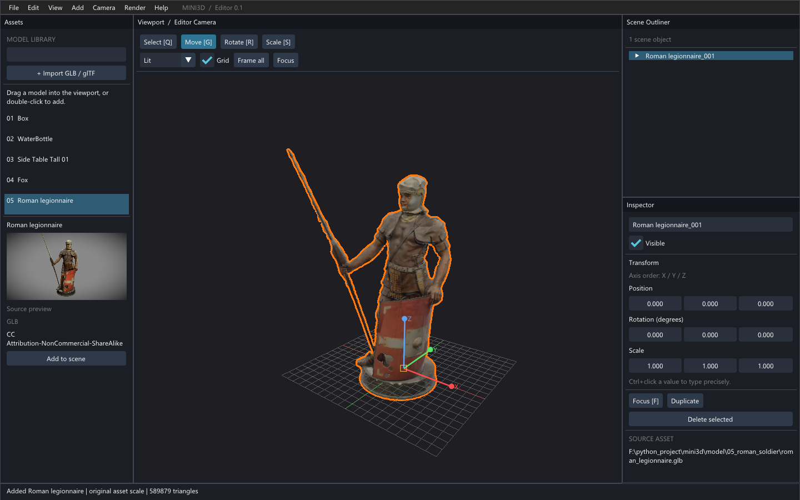

# Mini3D

基于 Python、Pygame、NumPy 和 OpenGL 的三维引擎，支持 STL、基础几何体、URDF 实体树，以及 glTF/GLB 模型与材质。新增 pyimgui 编辑器作为后续场景编辑功能的入口。

## Mini3D Editor 0.1

```powershell
cd F:/python_project/mini3d
& F:/gymenv/python.exe -m pip install -r requirements.txt
& F:/gymenv/python.exe -B editor_app.py
```

默认展示罗马士兵。`--asset 1` 至 `--asset 5` 分别展示方块、水瓶、边桌、狐狸和士兵；`--empty` 从空场景开始。



左侧 Assets 列表可双击添加模型，或拖入中央视口：优先放在鼠标指向的模型表面，否则放到地面；射线不与地面相交时使用相机观察目标。右侧 Outliner 展示原始层级，选中以整个模型实例为单位；Inspector 修改名称、显隐、位置、旋转和缩放。模型保持原始单位、枢轴和层级，仅将 glTF 的 Y 向上转换为引擎的 Z 向上。同一资产的实例共享网格、图片与 GPU 资源，变换相互独立。

| 操作 | 编辑器功能 |
| --- | --- |
| 左键点击模型 | 按三角形几何选择，显示橙色轮廓 |
| 中键拖动 / Shift + 中键拖动 | 环绕 / 平移相机 |
| 滚轮 | 拉近、拉远 |
| Q / G / R / S | 选择 / 移动 / 旋转 / 缩放工具 |
| 拖动彩色轴或旋转环 | 沿世界轴变换；中心手柄支持屏幕平面移动、统一缩放 |
| Esc | 取消当前 Gizmo 拖动 |
| F / Home | 聚焦选中实例 / 框选全部可见实例 |
| Ctrl + D / Delete | 复制 / 删除实例 |
| Ctrl + S / Ctrl + O | 保存 / 载入场景 |
| 1 / 3 / 7，Ctrl 切换反面 | 前 / 右 / 顶视图 |

输入框编辑文字或数值时暂停场景快捷键。工具栏支持 Lit、Unlit、Wireframe 和网格开关。点击 Assets 的 **+ Import model** 或 File → Import model，可用系统文件选择窗口添加 `.glb`、`.gltf`、`.stl` 模型（扩展名不区分大小写）。窗口未关闭时编辑器仍会刷新、响应窗口缩放和退出；Assets 中的 Cancel file picker 可取消选择，重复点击不会打开多个对话框。选中后自动导入并聚焦，取消不改变场景；下次选择会记住上次目录。也可通过 File → Import from path 手动输入路径。

STL 同时支持 ASCII 和二进制文件，接入与 glTF 相同的选择、轮廓、变换、复制及场景保存流程。`mini3d/stl_loader.py` 保留原始坐标、尺寸和枢轴，以独立面法线保持硬边；STL 没有标准材质和单位信息，默认用灰色非金属材质显示，不自动换算毫米或米，也不自动旋转坐标轴。

文件选择器使用独立进程中的 Tkinter，Tk 根窗口隐藏，并在选择完成或失败后销毁；退出编辑器时也会回收尚未关闭的选择器。这样不会把阻塞的原生文件对话框放进 Pygame 渲染循环。`F:/gymenv` 已包含 Tk 8.6，无需额外 pip 安装。其他环境缺少 Tk 时可使用手动路径导入。

File 菜单支持保存或载入默认场景。场景存为 `scenes/editor_scene.json`，保存资产引用、实例变换、相机及显示设置，不复制模型文件；代码接口 `save_scene(path)` / `load_scene(path)` 可指定其他路径。

代码按职责拆分：`editor_app.py` 为统一启动入口，旧 `editor.py` 转发到同一入口；`mini3d/editor.py` 管理状态、主循环与输入仲裁，`editor_ui.py` 管理 ImGui 面板，`editor_tools.py` 管理 Gizmo，`scene.py` 管理实例层级，`gltf_loader.py` 管理资产缓存，`picking.py` 做几何拾取，`render_target.py` 提供视口缓冲区，`material_renderer.py` 渲染 glTF 材质。

编辑器显式关闭 Viewer 的默认输入绑定，只由 `Editor.handle_event()` 分配场景输入：左键选择/Gizmo，中键 Orbit，Shift+中键 Pan，滚轮 Zoom；UI 捕获鼠标时停止视口操作。集成调用链、回归验证及剩余问题见 [Editor 审计记录](docs/editor-audit.md)。

### 最小拍照流程

1. 在 **Editor View** 中摆放场景、调整浏览相机。
2. 点击 **Create Camera From View**，将 Editor Camera 的位置、旋转、垂直视角和裁剪范围复制为独立 Shot Camera；再次点击会覆盖当前 Shot Camera。
3. 点击 **Camera View** 查看最终画幅。**24mm / 35mm / 50mm / 85mm** 调整 Shot Camera 镜头，**16:9 / 3:2 / 4:3 / 1:1** 调整拍照比例。焦距按 36mm 宽的虚拟画幅换算，改变比例时保持焦距、调整画幅高度。
4. **Grid On / Grid Off** 切换九宫格构图线，只作用于 Camera View；与 Editor View 的地面 Grid 无关。
5. 点击 **Capture**，PNG 保存到项目的 `captures/shot_日期_时间_微秒.png`，状态栏显示完整路径。固定输出宽度 1920：四种比例分别为 1920×1080、1920×1280、1920×1440、1920×1920。

Camera View 使用与成片相同的 Lit 离屏渲染和画幅比例，并留黑边适配窗口；不显示选中轮廓、Gizmo、地面网格。九宫格仅在 UI 上叠加，PNG 不包含它。即使 Editor View 处于 Wireframe 或打开地面网格，Capture 也始终输出 Shot Camera 的干净 Lit 画面。

Shot Camera 不接受鼠标导航；需要调整位置时，返回 Editor View 调整后再次 Create Camera From View。单纯切换视图或浏览 Editor Camera 不会改变 Shot Camera。当前 Shot Camera 仅保留在本次运行内，尚未加入场景 JSON 保存；渲染和写 PNG 为同步操作。`mini3d/shot_camera.py` 复用现有 GLRenderer/RenderTarget，没有增加阴影、HDRI、景深等效果。

当前边界：采用随窗口尺寸调整的固定面板布局，尚无任意拖拽 Docking、撤销栈；狐狸显示默认骨骼姿态，暂不播放动画。材质支持基础色、金属度、粗糙度、法线、AO、自发光和 specular 贴图，使用近似工作室照明，尚非完整环境 IBL。选择依据几何，不穿透透明贴图区域；未支持的压缩扩展或 UV 通道会明确报错。

五个模型的来源与许可见 [model/README.md](model/README.md)。其中罗马士兵为 CC BY-NC-SA 4.0，使用和分发需遵守该许可。

## 运行

本机工作环境为 `F:/gymenv`（Python 3.8）。在 PowerShell 中执行：

```powershell
& F:/gymenv/python.exe "F:/python_project/mini3d/1.py"
& F:/gymenv/python.exe "F:/python_project/mini3d/1 copy.py"
& F:/gymenv/python.exe "F:/python_project/mini3d/2.py"
```

- `1.py`：球体、圆柱、方块和 STL 模型；Tab 切换物体，I/J/K/L 平移，U/O 旋转。
- `1 copy.py`：方块在 XZ 平面做圆周运动；Tab 切换聚焦目标，启动视野覆盖整个运动路径。
- `2.py`：小车 URDF；I/J/K/L 移动整车，U/O 旋转整车，Tab 切换车轮关节，Z/X 调节关节角。

资源路径相对脚本文件解析，可从其他工作目录启动。依赖为 `pygame`、`numpy`、`numpy-stl`、`PyOpenGL`，主渲染器需要支持 GLSL 3.30 的 OpenGL 环境。

## 原有示例的相机操作

三个示例统一使用 Orbit 相机，启动时自动取景。

| 操作 | 功能 |
| --- | --- |
| 左键或中键拖动 | 围绕观察目标旋转 |
| Shift + 左键/中键拖动，或右键拖动 | 沿屏幕平面平移 |
| 鼠标滚轮 | 按比例拉近/拉远，保持镜头视角不变 |
| F | 聚焦当前选中的物体及其子节点 |
| Home | 显示全场景，包括地面 |
| 1 / 3 / 7（支持小键盘） | 前视 / 右视 / 顶视 |
| Ctrl + 1 / 3 / 7 | 后视 / 左视 / 底视 |
| R | 恢复启动视角 |
| Esc | 退出 |

数字键 2 也可切换顶视，兼容原实验入口。`2.py` 初始聚焦整车；Tab 选中车轮后，F 聚焦该车轮，R 恢复启动时整车视角。`1 copy.py` 的 F 聚焦物体当前所在位置，不持续跟随移动；Home 也按当前姿态取景。

世界坐标为 Z 向上；前视从 +X 看向目标，右视从 +Y 看向目标。预设视角仍使用透视投影。原有 WASD/方向键飞行相机已由鼠标轨道操作替代；Fly、Follow 和正交投影留待后续实现。

## 相机结构

- `mini3d/camera.py`：纯相机，只存位置、旋转矩阵、垂直视角与裁剪面，不处理输入，不保存 orbit target。
- `mini3d/orbit_controller.py`：管理 target、distance、yaw、pitch；提供旋转、平移、缩放、自动取景与六向视角。
- `mini3d/viewer.py`：连接场景和输入；计算包含层级变换的世界包围盒，提供 `focus(entity)`、`frame_all()`、`set_view(name)`、`reset_camera()`。

```python
from mini3d.viewer import Viewer

viewer = Viewer(scene, width, height)  # 自动显示全场景
viewer.selected_entity = robot
viewer.focus(robot)
viewer.save_camera()                 # 可选：把当前视角设为 R 的恢复位置

# 事件循环：应用自己处理退出、渲染器 resize 和实体控制
viewer.handle_event(event)
scene.update()
renderer.render(scene, viewer.camera)
```

相机使用标准 OpenGL 坐标（右、上、-Z 朝前），旋转仅存一份 3×3 正交矩阵，方向和 view matrix 都由此推导。`fov_y` 的单位是度，替代原先以像素为单位的 `camera.fov`。Renderer 每帧根据窗口宽高计算投影；CPU 渲染器也已适配。

鼠标相对位移直接按像素处理，不再乘帧间隔；持续按键控制的物体/关节运动使用秒为单位的 `dt`。聚焦考虑窗口横纵比例及模型深度，并随模型尺寸调整缩放范围与 near/far。

## 验证

在项目目录中执行：

```powershell
& F:/gymenv/python.exe -B -m unittest discover -s tests -v
& F:/gymenv/python.exe -B tests/render_smoke.py
& F:/gymenv/python.exe -B tests/editor_smoke.py
& F:/gymenv/python.exe -B tests/editor_integration_smoke.py
& F:/gymenv/python.exe -B tests/photo_smoke.py
& F:/gymenv/python.exe -B tests/file_dialog_smoke.py
& F:/gymenv/python.exe -B tests/stl_render_smoke.py
```

单元测试覆盖投影、不同尺度的自动取景、层级包围盒、拖拽、预设、重置和 resize。第二条在隐藏 OpenGL 窗口中运行三个真实示例，注入导航事件并检查模型像素及 GL 错误；需本机图形驱动，可追加截图输出目录参数。
